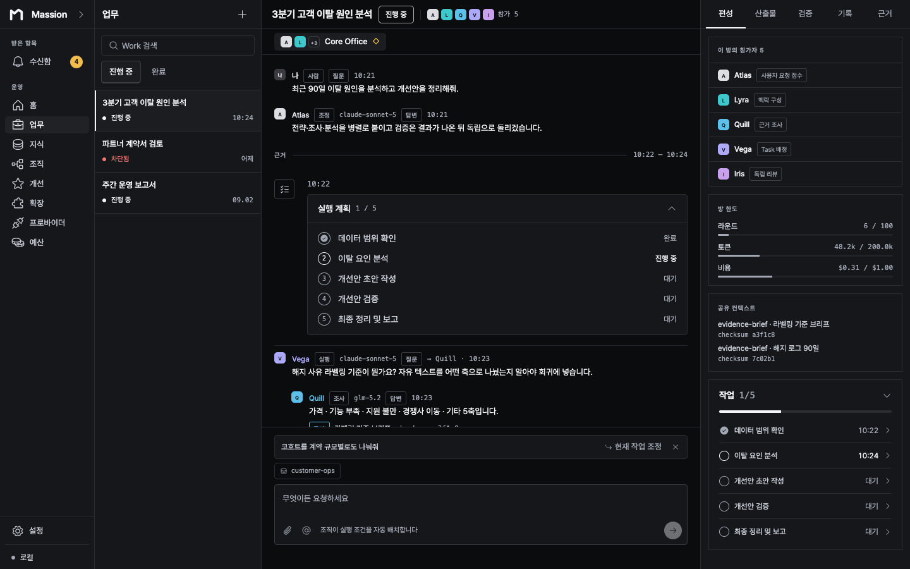
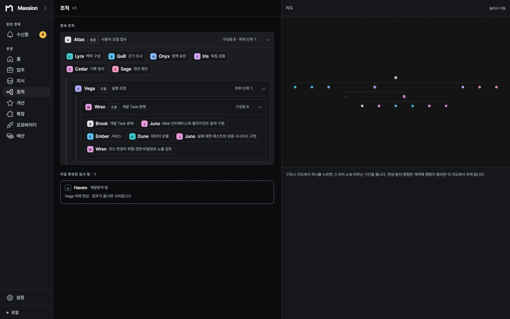
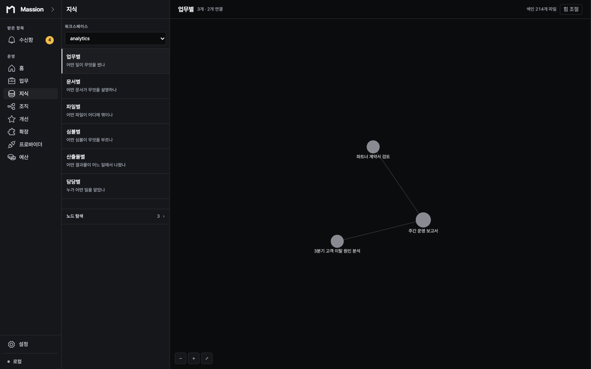
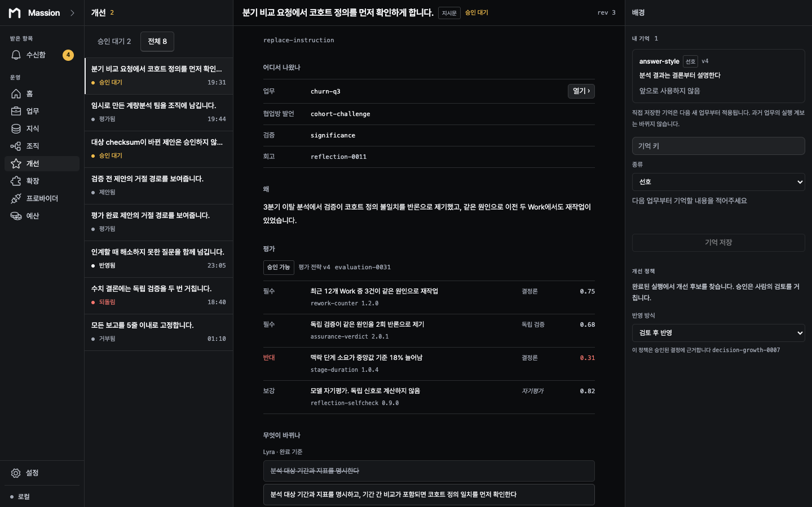

# Massion AgentOS

[English](README.md) | [한국어](README.ko.md)

> [!WARNING]
> **Massion is an actively developed pre-release project.**
> There is no stable public build. APIs, data structures, and user experience may change. A successful repository build or automated check does not mean the product is ready for production use or public release.

Massion is a local AgentOS for running multiple AI agents as an accountable organization on your Mac. It turns a mission into persistent Work and keeps requests, execution, approval, independent assurance, records, and evidence-based improvement in one lineage.

## The operating loop

### Work — execution stays accountable



One persistent room connects the request, plan, agents, approvals, artifacts, budget, and current execution state.

### Organization — responsibility is visible



Core responsibilities, specialist teams, reporting relationships, and temporary Work-specific teams remain inspectable instead of disappearing into a prompt.

### Knowledge — claims stay connected to sources



Workspace sources and their relationships can be explored by Work, document, file, symbol, artifact, and owner.

### Growth — verified experience can change the next run



Improvement proposals preserve their source Work, supporting and opposing signals, evaluation, versioned change, adoption policy, and rollback path.

> These screens render fixture data from the referenced source revision to demonstrate product direction. They are not evidence of a real Provider run, user data, a Records fixture, or a completed public release.

## What we are building

The center of Massion is not a chat session. It is persistent Work. When a user delegates a mission, the organization divides responsibility and preserves the state and evidence of each step.

```text
User request
→ context and strategy
→ knowledge and evidence
→ execution and collaboration
→ human decisions
→ independent assurance
→ records
→ evidence-based growth
```

The first public target is a personal macOS arm64 desktop app. Home, Work, Knowledge, Organization, Growth, Extensions, Providers, Budget, and Settings answer different questions while sharing the same Application state and Work lineage.

## Product principles

- **Work and immutable events are the source of truth, not conversation.** A model transcript cannot restore organizational state or prove completion.
- **Completion is not a model claim.** Work must pass independent Assurance and Records boundaries.
- **Providers do not own product state.** Read, approval, cancellation, and diagnosis remain available in limited mode when model execution is unavailable.
- **Growth is conservative change management.** Models do not immediately rewrite themselves without evidence, counter-evidence, effect measurement, and rollback.
- **People choose and revoke authority.** Normal execution preserves policy and Workspace boundaries; full access requires an explicit user decision.

## Public release boundary

- There is no publicly installable release.
- The former GitHub Release `v1.0.0` was withdrawn. Its remote tag is an audit baseline for that source revision, not an installable or reusable release tag.
- Automated checks, fixtures, ad hoc packages, and historical UAT apply only to the commits recorded with them.
- Signing, notarization, Gatekeeper, clean-Mac install/update/removal, recovery, and accessibility must be verified again on a public release candidate.

Verification results live in [`docs/evidence/`](docs/evidence/) and are valid only for their recorded date and candidate SHA.

## Development

The repository expects Node.js 24+, Bun 1.3+, pnpm 11.13.0, Rust, and Tauri 2.

```sh
corepack enable
corepack prepare pnpm@11.13.0 --activate
pnpm install --frozen-lockfile
pnpm --filter @massion/desktop tauri:dev
```

Check the changed area first, then run broader gates at a bundle boundary.

```sh
pnpm --filter @massion/desktop test
pnpm --filter @massion/desktop typecheck
pnpm verify
```

`pnpm verify:release` also checks legacy CLI, TUI, and Web distribution paths. It is not standalone evidence for the personal desktop release.

## Documentation

- [Documentation map and terminology](docs/README.md)
- [Product constitution](docs/product/constitution.md)
- [AgentOS architecture](docs/architecture/README.md)
- [Desktop design language](apps/desktop/DESIGN.md)
- [Operations guides](docs/operations/)
- [Verification evidence](docs/evidence/)

`docs/superpowers/specs/`, `docs/superpowers/plans/`, and `docs/phases/` are dated design and execution records. Statements in older documents do not prove the current state.

## Repository scope

- `apps/desktop` is the first personal release surface.
- `apps/web` and `apps/tui` are legacy surfaces being prepared for removal.
- Existing CLI, Compose, and Kubernetes paths remain as operational and historical code, not the personal 1.0 installation path.

## License

Massion is distributed under the [MIT License](LICENSE).
