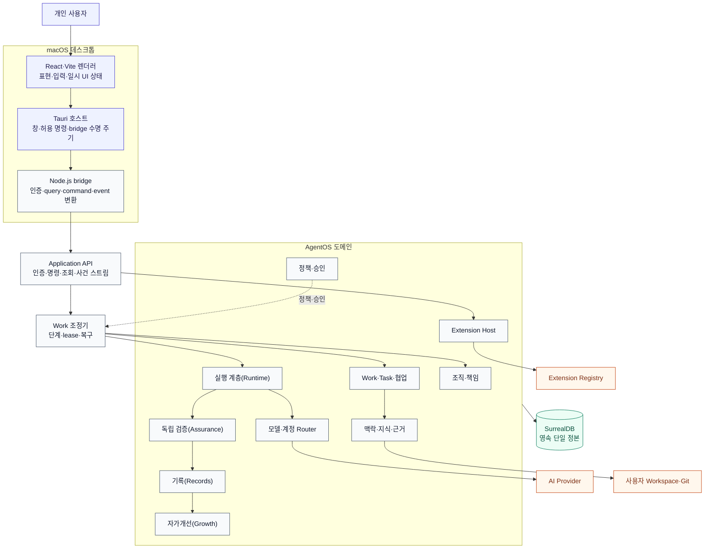
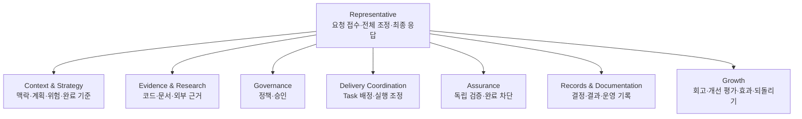
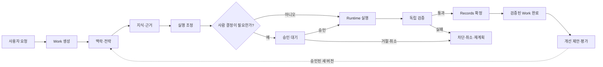
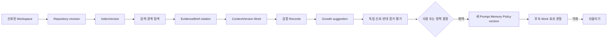
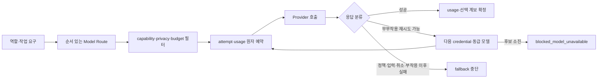
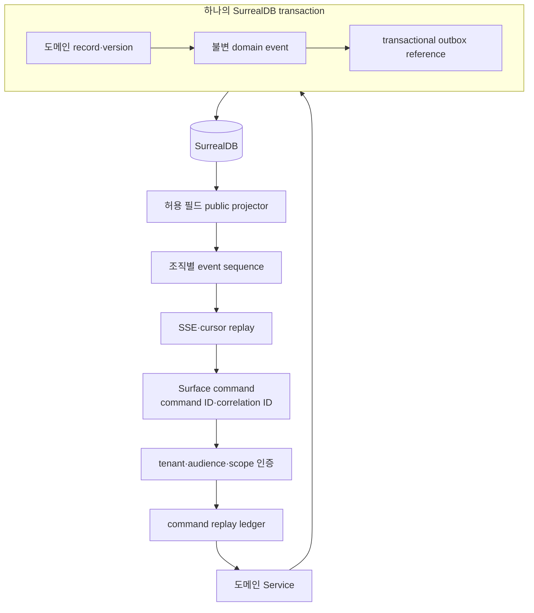
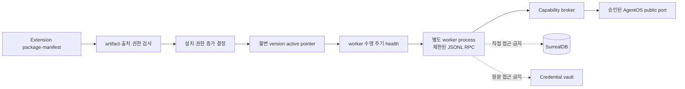

# Massion AgentOS 아키텍처

[English](README.md) | [한국어](README.ko.md)

이 문서는 Massion의 구성요소, 책임 경계와 데이터 흐름을 설명합니다. 제품의 목적과 불변 원칙은 [제품 헌법](../product/constitution.ko.md), 공개 릴리스 경계는 [저장소 README](../../README.ko.md)가 소유합니다.

아키텍처 문장은 완료 여부를 판정하지 않습니다. 소스 경로는 책임의 위치를 가리킬 뿐, 공개 릴리스나 사용자 인수 검증을 증명하지 않습니다.

## 1. 설계 원칙

1. **업무(Work)가 정본입니다.** 대화와 모델 transcript는 인터페이스이며 실행·복구·완료는 Work와 불변 사건으로 판정합니다.
2. **도메인이 자기 불변량을 소유합니다.** Application 계층은 서비스를 조합하지만 조직, revision, 승인, 검증과 계보를 대신 판단하지 않습니다.
3. **실행 엔진과 Provider는 교체 가능한 경계입니다.** VoltAgent와 특정 모델의 타입을 제품 계약으로 노출하지 않습니다.
4. **완료는 독립 검증(Assurance) 뒤에만 가능합니다.** 실행 주체의 성공 선언만으로 Work를 완료하지 않습니다.
5. **자가개선(Growth)은 버전·평가·효과·되돌리기를 보존합니다.** 새 제안이 즉시 활성 정책이 되지 않습니다.
6. **SurrealDB가 영속 상태의 단일 정본입니다.** 화면과 프로세스 메모리는 재구성 가능한 투영입니다.
7. **비밀과 권한은 프로세스 경계에서 축소합니다.** 렌더러와 Extension은 토큰, raw credential과 데이터베이스에 직접 접근하지 않습니다.

## 2. 전체 시스템

첫 공개 제품 경계는 한 명의 사용자가 자기 Mac에서 운영하는 데스크톱 AgentOS입니다.

화살표는 호출 방향과 영향 관계를 보여줍니다. 외부 경계는 Massion이 소유하지 않는 계정, 파일과 서비스입니다.

## 3. 책임과 패키지 경계

| 책임 | 소유 위치 | 경계 |
|---|---|---|
| 공통 식별자·계약 | `packages/foundation` | 도메인에 종속되지 않는 값과 오류 |
| 데이터베이스 facade·migration | `packages/storage` | SurrealDB SDK 타입을 상위 계약에 노출하지 않음 |
| 사용자·조직 격리 | `packages/identity` | 모든 영속 조회와 변경의 tenant 문맥 |
| 조직 그래프·책임 | `packages/organization` | 역할, 관계, 버전과 조직 변경 |
| Work·Task·협업방 | `packages/work` | 업무 상태, revision, 메시지와 산출물 |
| 정책·승인 | `packages/governance` | 행동 허용, 사람 결정과 영향 기록 |
| 모델·계정 선택 | `packages/router` | 후보 필터, credential, 예산, fallback과 attempt |
| 에이전트 실행 | `packages/runtime` | 실행, 재개, 취소, session과 사용량 |
| 맥락·전략 | `packages/context-strategy` | ContextVersion, 계획과 완료 기준 |
| 코드·문서 지식 | `packages/evidence` | Repository, index, 검색, 관계와 EvidenceBrief |
| 개발 실행 | `packages/software-engineering` | 격리 Workspace, TDD delivery와 복구 |
| 독립 검증 | `packages/assurance` | criterion, check, finding과 완료 판정 |
| 기록 | `packages/records` | WorkRecord, ADR, 변경·운영 기록 |
| 자가개선 | `packages/growth` | 제안, 평가, 채택, 효과와 되돌리기 |
| 제품 API 조합 | `packages/application` | 인증된 query·command·event 계약 |
| 서버 composition root | `apps/server` | 도메인 서비스와 외부 adapter 조립 |
| 데스크톱 | `apps/desktop` | 화면, Tauri, bridge와 로컬 수명 주기 |

패키지는 다른 도메인의 raw store를 직접 수정하지 않습니다. 여러 도메인을 원자적으로 확정해야 할 때는 명시적인 port와 하나의 데이터베이스 transaction으로 경계를 연결합니다.

## 4. 조직과 책임

Core Office는 이름이 아니라 Work 처리에 필요한 책임을 고정합니다.

조직 노드는 영속적인 책임과 권한을 나타냅니다. 실제 모델 프로세스는 Work가 필요할 때 실행되며 조직 노드의 수명과 같지 않습니다. 전문 조직과 임시 팀은 Core Office의 책임을 대체하지 않고 특정 실행 능력을 제공합니다.

## 5. Work 처리 흐름

개발 작업과 비개발 작업은 실행 방식이 달라도 같은 완료 경계를 사용합니다.

### Work 종료 의미

| 상태 | 의미 | 다음 행동 |
|---|---|---|
| `completed` | 독립 검증과 Records를 거친 종료 | 산출물·검증·기록 확인 |
| `awaiting-approval` | 사람의 결정 전까지 정지 | 근거 확인 후 승인·거절 |
| `blocked` | 복구 가능한 조건이 부족함 | Provider·정책·입력을 해결한 뒤 재개 |
| `failed` | 자동 복구할 수 없는 실패 | 진단 후 새 실행 또는 명시적 복구 |
| `cancelled` | 사용자가 실행을 중단함 | 읽기와 새 실행만 허용 |

Application run은 단계, lease generation과 결정적 command ID를 저장합니다. 재시작은 저장 상태에서 이어가며 이미 확정된 외부 효과를 반복하지 않아야 합니다.

## 6. 지식과 자가개선

지식(Knowledge)은 Workspace의 파일·문서·심볼·산출물·Work 관계를 검색과 인용에 제공합니다. Knowledge가 Work를 대신하지 않으며, 모든 인용은 Repository와 IndexVersion 계보를 보존합니다.

자가개선은 과거 Work를 다시 쓰지 않습니다. 새 버전은 이후 실행부터 적용되며, 원인 Work·Evidence·평가 영수증·효과 관측과 되돌리기가 같은 계보에 남습니다.

## 7. Provider와 실행 계층

사용자는 Provider 계정을 연결하지만 개별 Work마다 모델을 직접 고르지 않습니다. 전략과 역할별 정책이 허용 후보를 만들고 Router가 capability, 데이터 정책, 예산, 계정 상태와 평가 근거를 적용합니다.

Credential 평문은 이벤트, 오류와 화면에 노출하지 않습니다. fallback은 첫 token이나 도구 부작용 전에 실패했음을 증명할 수 있을 때만 허용합니다. 실제 선택 profile, credential, batch와 사용량은 route attempt의 계보로 남습니다.

## 8. 명령·사건·복구

- 같은 command ID와 같은 canonical 요청은 저장된 결과를 재생합니다.
- 같은 command ID에 다른 요청은 거부합니다.
- record, event와 outbox 중 하나라도 실패하면 transaction 전체를 롤백합니다.
- public projector는 허용된 필드만 내보내며 raw row와 secret을 반환하지 않습니다.
- 재연결은 조직별 cursor 이후 사건을 순서대로 재생합니다.

## 9. Extension 신뢰 경계

Extension은 코어 수정 없이 Capability를 추가하지만 Core process, 데이터베이스와 credential을 직접 받지 않습니다.

활성화는 artifact, manifest, 출처와 승인 계보를 보존해야 합니다. worker가 요청할 수 있는 기능은 선언된 Capability와 public port의 교집합으로 제한합니다. 비활성화, update와 rollback은 기존 Work의 과거 계보를 변경하지 않습니다.

## 10. 데스크톱 프로세스와 보안 경계

| 계층 | 소유 책임 | 금지 사항 |
|---|---|---|
| React 렌더러 | 표현, 입력, 접근성, 일시 UI 상태 | 토큰 저장, daemon 직접 접속, 범용 native API |
| Tauri 호스트 | 창, 허용 IPC, native picker, bridge 수명 주기 | 외부 Web URL, 범용 shell·filesystem 권한, 업무 판정 |
| Node.js bridge | daemon 보장, 인증, query·command·event 변환 | raw secret·header·stack 전달, 임의 명령 실행 |
| Massion daemon | Application API, 도메인, Runtime, 영속 상태 | 데스크톱 전용 표현 상태 |

렌더러는 daemon URL과 access token을 받지 않습니다. Tauri capability는 필요한 명령만 열고, bridge 메시지는 크기·schema·동시 요청 제한을 적용합니다. 앱 창과 daemon의 수명은 같지 않으며 앱을 닫아도 영속 Work와 데이터는 보존됩니다.

개인용 1.0은 macOS arm64 데스크톱을 대상으로 합니다. 저장소에 남은 CLI, Web, TUI, Compose와 Kubernetes 경로는 별도 운영·역사 경계이며 개인용 공개 릴리스의 완료 조건으로 사용하지 않습니다.

## 11. 관련 결정

- [개인용 전체 권한 실행 모드](ADR-001-personal-full-access.ko.md)
- [지식 축과 표면 복원](ADR-002-knowledge-axis-restoration.ko.md)
- [작업 인지 모델 배치](ADR-003-task-aware-model-placement.ko.md)
- [독립 데스크톱 전환](desktop-clean-sheet.ko.md)
- [데스크톱 시각 언어](../../apps/desktop/DESIGN.ko.md)
- [문서 지도](../README.ko.md)
아키텍처 변경은 ADR로 결정하고, 동작 여부와 출시 판정은 같은 후보 SHA에서 실행한 검증으로 판정합니다.
