# Massion AgentOS 1.0 전체 아키텍처

> **문서 상태**: 현재 구현 아키텍처 정본
> **기준일**: 2026-07-13
> **제품 구현 기준**: 공개 `main` 브랜치의 현재 코드·테스트·운영 문서
> **진행 근거**: [요구사항 추적표](../generated/requirements-traceability.tsv)와 Phase 24~28 문서

이 문서는 Massion을 처음 접하는 사람과 구현 에이전트가 제품 전체를 빠르게 파악하도록 돕습니다. 현재 공개 저장소에 존재하는 코드와 검증 가능한 동작을 같은 그림에 표시하되 상태를 명확히 구분합니다. 세부 계약은 도메인 코드·테스트, 운영 문서와 현재 Phase 문서가 소유하며, 이 문서는 그 관계를 연결하는 지도입니다.

근거는 실제 코드·테스트, 운영 문서, 현재 Phase 설계·회고 순으로 판정합니다. 새 저장소 전환 때 제외한 과거 Phase 문서나 대체된 개념도는 현재 구조의 근거로 사용하지 않습니다.

## 1. 읽는 법과 상태 범례

| 시각 표현 | 상태 | 의미 |
|---|---|---|
| 녹색 실선·`구현됨` | 구현됨 | 현재 저장소에 코드와 관련 테스트·검증 근거가 있음 |
| 파란색 굵은 실선·`구현 중` | 구현 중 | 코드가 존재하지만 현재 Phase 완료 검증 전 |
| 회색 점선·`예정` | 예정 | 승인된 1.0 범위이나 아직 구현되지 않음 |
| 주황색 이중선·`외부` | 외부 시스템 | Massion이 소유하지 않는 서비스·저장소 |

굵은 화살표는 사용자 Work의 주 실행 경로, 일반 실선은 동기 명령·직접 호출, 점선은 이벤트·관찰·정책 영향을 뜻합니다. 원통은 영속 저장소, 큰 경계 상자는 프로세스 또는 배포 단위입니다. 색상을 볼 수 없는 환경에서도 상태 라벨과 선 모양으로 구분할 수 있습니다.

그림의 구현 상태는 과거 Phase 번호만으로 판정하지 않고 현재 코드와 검증 결과를 함께 확인합니다. 새 저장소에는 Phase 24 이후의 유지보수·전환 문서만 남아 있으며, 외부 권한이 필요한 실제 계정·공개 tag·OIDC·cluster 검증은 실행하지 않은 범위를 성공으로 표시하지 않습니다.

## 2. 전체 시스템 지도

Massion은 사용자 요청을 일회성 채팅이 아닌 영속 업무(Work)로 만들고, 조직이 계획·조사·실행·검증·기록·개선을 분담하는 AgentOS입니다. CLI·TUI·Web·외부 Surface는 같은 Application API와 상태를 사용합니다.

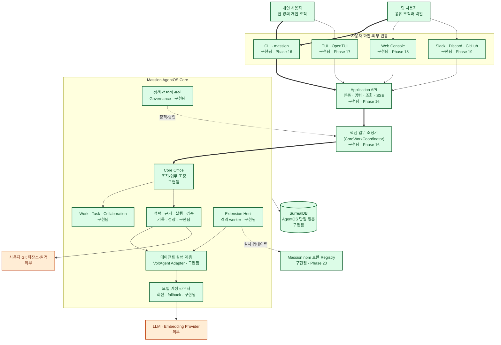

| 요소 | 상태 | 실제 위치 | 근거 |
|---|---|---|---|
| CLI·Application API | 구현됨 | `apps/cli`, `packages/application` | 명령·조회·인증·이벤트 테스트 |
| TUI | 구현됨 | `apps/tui` | 상태·표현·OpenTUI 렌더러 테스트 |
| Core Office·Work·Governance | 구현됨 | `packages/organization`, `packages/work`, `packages/governance` | 조직·업무·승인 통합 테스트 |
| Runtime·Router | 구현됨 | `packages/runtime`, `packages/router` | 모델 생성·실행·라우팅 실패 테스트 |
| Extension Host | 구현됨 | `packages/extension-host` | 격리·권한·수명주기 테스트 |
| Web Console | 구현됨 | `apps/web` | 페이지·상태·사용자 흐름 테스트 |
| Slack·Discord·GitHub Surface | 구현됨 | `packages/integrations`, `extensions/slack`, `extensions/discord`, `extensions/github` | 공식 통합 계약 테스트 |
| Registry·Marketplace | 구현됨 | `packages/registry`, `apps/cli`, `apps/web` | 게시·정책·검색·설치 테스트 |
| SurrealDB 단일 정본 | 구현됨 | `packages/storage` | transaction·schema·migration 테스트 |

## 3. 제품 구성요소와 패키지 경계

각 패키지는 자신이 소유한 도메인 불변량을 검사합니다. Application 계층은 공개 서비스를 조합하지만 Work revision, tenant 격리, 정책, 승인, 증거 계보를 대신 판정하지 않습니다. VoltAgent는 실행 메커니즘이며 Massion의 공개 계약으로 노출되지 않습니다.

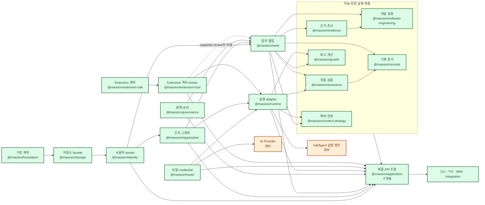

| 경계 | 규칙 | 실제 위치 |
|---|---|---|
| 데이터 | SurrealDB SDK 타입은 저장소 facade 위 도메인 계약에 노출하지 않음 | `packages/storage` |
| 실행 | VoltAgent 타입은 Runtime adapter 내부에 격리 | `packages/runtime` |
| 제품 API | 도메인 공개 서비스만 조합하고 raw store를 반환하지 않음 | `packages/application` |
| Extension | worker는 capability broker만 사용하고 Database·credential에 직접 접근하지 않음 | `packages/extension-sdk`, `packages/extension-host` |

## 4. Core Office와 전문 조직

Core Office는 설치와 함께 모든 tenant 조직에 생성되는 제거 불가능한 여덟 개 내장 노드입니다. 조직 노드는 영속하지만 LLM 프로세스가 항상 실행되는 것은 아니며, Work가 필요로 할 때 Agent로 materialize됩니다. Software Engineering은 기본 배포판에 포함되지만 비내장(non-builtin) 전문 조직이고, Extension 조직은 설치·권한 부여 후에만 추가됩니다.

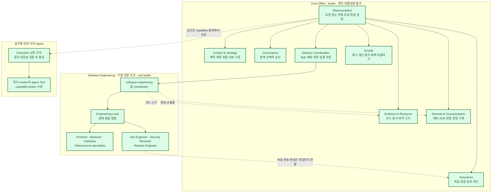

| 조직 유형 | 변경 가능성 | 실행 방식 | 실제 위치 |
|---|---|---|---|
| Core Office 8개 | 제품 migration 외 변경 불가 | Work에 필요할 때 Agent materialize | `packages/organization`, `packages/runtime` |
| Software Engineering 9개 역할 | 조직 명령으로 비활성화 가능, 기본 배포 bootstrap은 활성 요구 | 격리 Git workspace와 TDD delivery | `packages/software-engineering` |
| Extension 조직·Agent | manifest·정책·승인·호환성 범위에서 설치·업데이트·rollback | Core 밖 격리 worker | `packages/extension-sdk`, `packages/extension-host` |

## 5. Work 처리 전체 흐름

대화가 아니라 Work와 불변 사건이 실행·복구의 정본입니다. 개발 작업과 비개발 작업은 Delivery에서 전문 실행 경로가 달라질 수 있지만, 어느 경로도 독립 Assurance와 Records를 생략해 완료할 수 없습니다.

```mermaid
flowchart LR
  classDef implemented fill:#dcfce7,stroke:#166534,color:#14532d,stroke-width:2px;
  classDef implementing fill:#dbeafe,stroke:#1d4ed8,color:#1e3a8a,stroke-width:3px;
  classDef planned fill:#f3f4f6,stroke:#6b7280,color:#374151,stroke-width:1px,stroke-dasharray:5 5;
  classDef external fill:#ffedd5,stroke:#c2410c,color:#7c2d12,stroke-width:2px;

  Request["사용자 요청<br/>Request"]:::implemented
  Intake["대표 조직 접수<br/>Work 생성"]:::implemented
  Context["맥락·전략<br/>ContextVersion · Plan · Criteria"]:::implemented
  Evidence["근거 조사<br/>EvidenceBrief · source revision"]:::implemented
  Delivery{"실행 종류<br/>Delivery Coordination"}:::implemented
  Software["개발 작업<br/>Software Engineering<br/>TDD · Git provenance"]:::implemented
  Domain["비개발 작업<br/>전문 Agent·Tool 또는<br/>Representative 조정 실행"]:::implemented
  Approval{"정책상 승인이<br/>필요한가?"}:::implemented
  Auto["자동 실행<br/>auto 정책"]:::implemented
  Review["사람·조직 승인 대기<br/>review 정책"]:::implemented
  Runtime["Runtime Execution<br/>Task · Assignment · Artifact"]:::implemented
  Verify["독립 검증<br/>Assurance · Verification"]:::implemented
  Records["기록·문서 반영<br/>WorkRecord · ADR · Changelog · Runbook"]:::implemented
  Complete["검증된 Work 완료<br/>completed"]:::implemented
  Growth["회고·개선<br/>Suggestion · Evaluation · Adoption · Revert"]:::implemented

  Request ==> Intake
  Intake ==> Context
  Context ==> Evidence
  Evidence ==> Delivery
  Delivery -->|개발 criterion·Task| Software
  Delivery -->|그 밖의 전문 실행| Domain
  Software --> Approval
  Domain --> Approval
  Approval -->|아니오·auto| Auto
  Approval -->|예·review| Review
  Review -->|승인| Runtime
  Review -.->|거부·취소| Delivery
  Auto --> Runtime
  Runtime ==> Verify
  Verify -->|통과| Records
  Verify -.->|실패·차단·재계획| Delivery
  Records ==> Complete
  Complete ==> Growth
  Growth -. "승인된 개선만 새 버전 적용" .-> Context
```

| 단계 | 주요 정본 | 책임 패키지 |
|---|---|---|
| 접수·업무 | Request, Work, WorkEvent | `packages/work`, `packages/application` |
| 맥락·전략 | ContextVersion, StrategyGeneration, PlanVersion | `packages/context-strategy`, `packages/work` |
| 근거 | RepositoryRevision, IndexVersion, EvidenceBrief | `packages/evidence` |
| 실행 | RuntimeExecution, EngineeringDelivery, ArtifactVersion | `packages/runtime`, `packages/software-engineering`, `packages/work` |
| 검증 | AssuranceRun, criterion·check evidence, Verification | `packages/assurance`, `packages/work` |
| 기록·개선 | RecordsRun, WorkRecord, Growth Suggestion·Effect | `packages/records`, `packages/growth` |

## 6. 실행·승인·차단·취소·복구

핵심 업무 조정기 실행(Application run)은 현재 단계와 실행 임대 세대(lease generation)를 저장합니다. 자동 정책은 사람을 기다리지 않고 진행하고, review 정책만 `awaiting-approval`에서 정지합니다. 모델 부재는 성공이나 일반 실패로 꾸미지 않고 재시도 가능한 `blocked` 상태로 보존합니다.

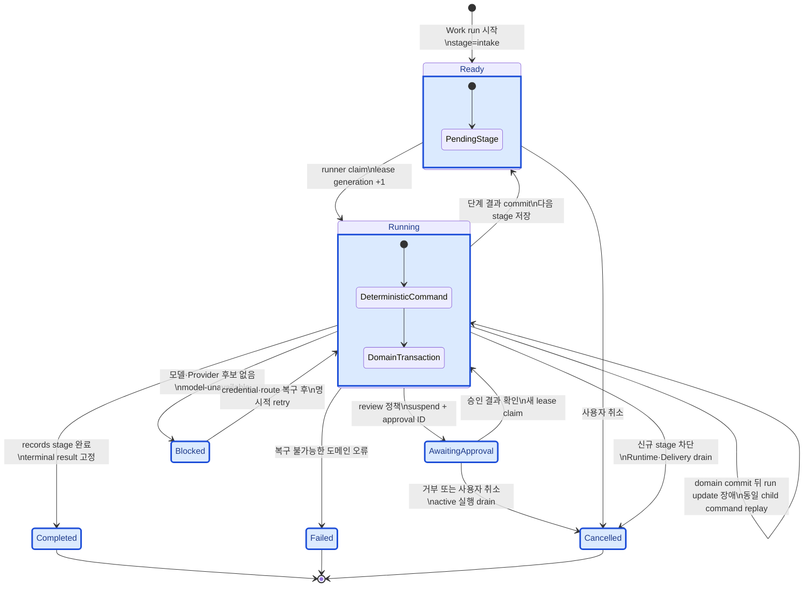

| 상황 | 저장되는 상태 | 복구 원칙 |
|---|---|---|
| 단계 실행 중 process crash | running + lease expiry | 만료 뒤 한 runner만 더 높은 generation으로 회수 |
| 도메인 commit 뒤 run 갱신 실패 | running + 이전 stage | `${runId}:${stage}` command를 replay하고 중복 side effect 차단 |
| 선택적 승인 필요 | awaiting-approval + approval ID | Governance의 영속 결정을 확인한 뒤 재개 |
| 모든 모델 경로 사용 불가 | blocked + reason | credential·route 복구 후 명시적 retry |
| 사용자 취소 | cancelled | 새 stage를 막고 활성 Runtime·Delivery를 먼저 drain |

## 7. 에이전트 협업과 대화

Organization Graph의 활성 노드는 tenant별 Agent map으로 투영됩니다. Agent는 상대를 발견해 직접 메시지나 다자 협업방에서 대화할 수 있고 독립 Task는 병렬 실행할 수 있지만, 메시지·위임·공유 맥락·실행·사용자 개입은 모두 하나의 Work와 인과 계보에 귀속됩니다.

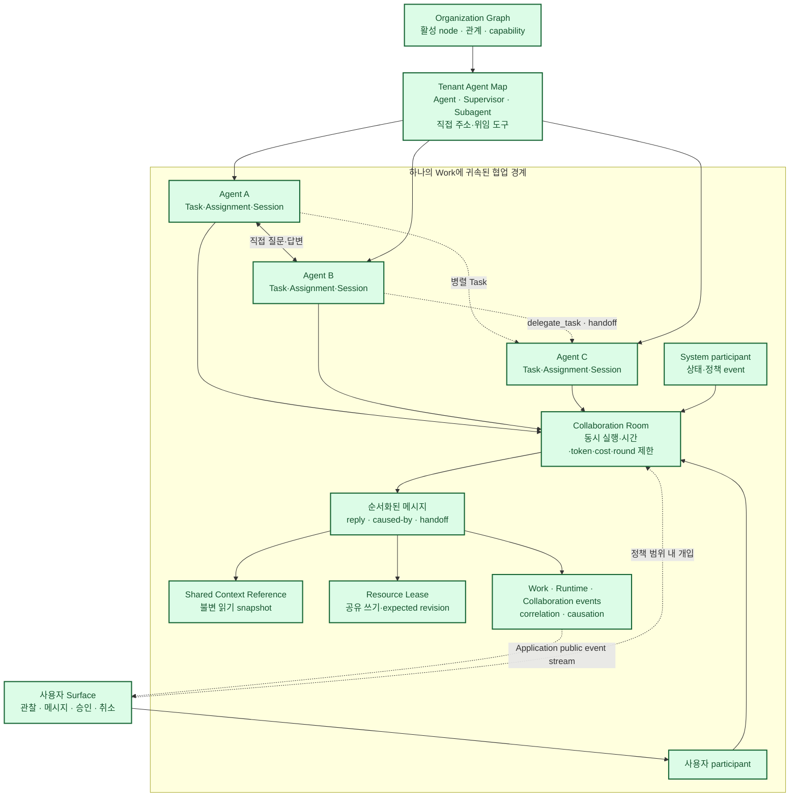

| 협업 요소 | 보장 | 실제 위치 |
|---|---|---|
| Agent map·위임 | 조직 버전에 맞는 활성 topology, 제거된 관계·Agent 반영 | `packages/runtime`, `packages/organization` |
| 직접·다자 대화 | 작성자, room sequence, reply·causation, 참조 계보 | `packages/work` |
| 병렬 실행 | 독립 Task, Assignment, Agent별 Session과 실행 제한 | `packages/work`, `packages/runtime` |
| 공유 상태 | 불변 SharedContextReference와 versioned resource lease | `packages/work` |
| 사용자 관찰·개입 | 공개 event, 승인·취소·메시지가 같은 Work에 기록 | `packages/application`, `packages/governance` |

## 8. 모델 계정·Provider 라우팅

Agent와 도메인은 실제 모델·계정을 직접 선택하지 않고 논리 모델 경로(Model Route)를 요청합니다. Router는 필수 capability, 데이터 정책, 예산, equivalence group과 평가 점수를 먼저 적용한 뒤 credential 정책으로 계정을 선택합니다. 지원 대상은 Provider가 자동화를 허용한 공식 API key, service account, workload identity와 OAuth이며 소비자 구독의 비공식 cookie·token 자동화는 포함하지 않습니다.

```mermaid
flowchart LR
  classDef implemented fill:#dcfce7,stroke:#166534,color:#14532d,stroke-width:2px;
  classDef implementing fill:#dbeafe,stroke:#1d4ed8,color:#1e3a8a,stroke-width:3px;
  classDef planned fill:#f3f4f6,stroke:#6b7280,color:#374151,stroke-width:1px,stroke-dasharray:5 5;
  classDef external fill:#ffedd5,stroke:#c2410c,color:#7c2d12,stroke-width:2px;

  Request["논리 모델 요청<br/>chat 또는 embedding<br/>capability · data policy · budget"]:::implemented
  Route["Model Route<br/>순서 있는 candidate·equivalence"]:::implemented
  Filter["후보 필터<br/>capability · local-private · eval · cost"]:::implemented
  Pool["Provider Credential Pool<br/>active · cooldown · disabled · revoked"]:::implemented
  Policy{"계정 선택 정책<br/>priority · fill-first · round-robin<br/>weighted · least-used · quota-headroom<br/>reset-aware · sticky"}:::implemented
  Reserve["원자 usage·budget 예약<br/>Attempt와 선택·제외 이유 기록"]:::implemented
  Call["모델 호출<br/>AI SDK · OpenAI-compatible · Ollama"]:::implemented
  Classify{"응답·오류 분류"}:::implemented
  Success["성공<br/>usage 확정"]:::implemented
  NextAccount["같은 Provider의<br/>다음 건강한 credential"]:::implemented
  Equivalent["동급 model candidate<br/>equivalence·eval 재검사"]:::implemented
  NextProvider["다른 Provider·gateway<br/>호환 candidate"]:::implemented
  Blocked["blocked_model_unavailable<br/>제외 이유·재개 가능 시각"]:::implemented
  Stop["fallback 중단<br/>입력·정책·예산·취소·첫 token 이후 실패"]:::implemented
  Providers["공식 Provider API<br/>OpenAI-compatible gateway · Ollama<br/>외부"]:::external

  Request --> Route
  Route --> Filter
  Filter --> Pool
  Pool --> Policy
  Policy --> Reserve
  Reserve --> Call
  Call --> Providers
  Providers --> Classify
  Classify -->|성공| Success
  Classify -->|401·만료| NextAccount
  Classify -->|429·quota·reset| NextAccount
  Classify -->|5xx·timeout·첫 token 전| NextAccount
  NextAccount -->|계정 있음| Reserve
  NextAccount -->|계정 소진| Equivalent
  Equivalent -->|동급 후보 있음| Pool
  Equivalent -->|동급 후보 소진| NextProvider
  NextProvider -->|호환 후보 있음| Pool
  NextProvider -->|모두 소진| Blocked
  Classify -->|비재시도 오류| Stop
```

| 경계 | 보장 | 실제 위치 |
|---|---|---|
| Credential | AES-256-GCM 암호문과 비밀 아닌 metadata만 저장, master key·평문 미기록 | `packages/router` |
| 계정 분산 | 동일 Provider 여러 credential을 결정론적 정책으로 선택 | `packages/router` |
| 모델 fallback | capability·데이터 정책·예산·equivalence·평가 기준을 모두 통과한 후보만 허용 | `packages/router` |
| 제한 모드 | 모델이 없어도 Identity·Work·조직·승인·기록·진단은 계속 동작 | `packages/router`, `packages/application` |

### 8.1 역할별 모델 평가실과 활성 배치

모델 평가실(Model Optimization Lab)은 사용자가 연결하고 검증한 모델만 역할별 평가 묶음으로 실행합니다. 품질·가성비·속도·개인정보 우선·수동 고정 정책 중 하나를 선택해 주 모델과 순서가 있는 fallback을 추천하며, 최초 추천은 승인 전까지 실행 경로에 반영하지 않습니다. 자동 최적화도 조직 정책의 명시적 동의가 있을 때만 최소 표본·개선 폭 게이트를 통과한 배치를 승격합니다.

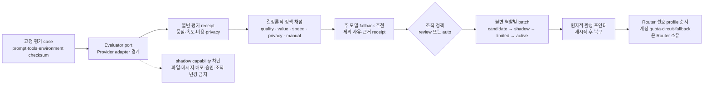

| 평가실 경계 | 보장 | 실제 위치 |
|---|---|---|
| 정본·영수증 | bundle, run, receipt, policy, recommendation, batch, observation, recovery의 tenant 격리와 checksum | `packages/model-optimization` |
| 후보 카탈로그 | 후보를 명시하지 않으면 서버 Router가 연결된 model profile만 제공하며 무료·공개 모델을 자동 추가하지 않음 | `apps/server/src/product.ts` |
| 실행 연결 | Provider별 실행은 `ModelEvaluationExecutor` port를 통해 주입하고 도메인은 Provider SDK를 직접 import하지 않음 | `packages/model-optimization/src/ports.ts` |
| 실사용 경로 | 활성 batch의 primary·fallback profile 순서를 Router에 전달하고 credential·quota·circuit·재시도는 기존 Router가 판정 | `packages/runtime`, `packages/router` |
| 기본 안전값 | 정책이 없으면 review·shadow 비활성, 추천은 `pending-approval`, shadow capability는 모두 차단 | `packages/model-optimization` |

## 9. 데이터·명령·이벤트 계보

SurrealDB는 AgentOS 데이터의 유일한 실행 정본입니다. Surface의 변경 명령은 인증·scope와 replay 원장을 통과하고, 각 도메인이 자신의 transaction 안에서 상태와 불변 event를 함께 기록합니다. Transactional outbox는 그 event의 참조를 같은 commit에 남기며, projector가 조직별 전역 순서를 가진 공개 event로 변환합니다.

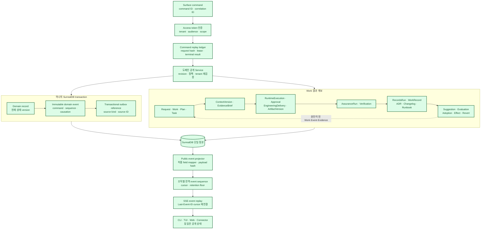

| 계보 구간 | 장애 시 행동 | 실제 위치 |
|---|---|---|
| command replay | 같은 command·같은 payload는 결과 replay, 다른 payload는 거부 | `packages/application`과 각 도메인 command ledger |
| domain transaction | record·event·outbox 중 하나라도 실패하면 전체 rollback | `packages/storage`, `packages/application` |
| public projection | source reference와 허용 mapper로 복구하며 secret·raw row를 반환하지 않음 | `packages/application` |
| Surface reconnect | 조직 cursor 이후 event를 순서대로 replay | `packages/application`, `apps/cli` |
| 결과 추적 | Work에서 실행·검증·기록·개선 원인까지 immutable ID·checksum으로 연결 | `packages/work`, `packages/assurance`, `packages/records`, `packages/growth` |

## 10. Extension·Registry·격리

Extension은 코어 수정 없이 능력을 추가하지만 Core process, SurrealDB 또는 credential을 직접 받지 않습니다. SDK는 정적 manifest·RPC 계약만 제공하고, Host가 artifact 검사·정책·승인·격리 worker·capability broker·health·rollback을 소유합니다. 공개 Registry는 게시·검사·검색·서명·provenance·리콜을 소유합니다.

```mermaid
flowchart LR
  classDef implemented fill:#dcfce7,stroke:#166534,color:#14532d,stroke-width:2px;
  classDef implementing fill:#dbeafe,stroke:#1d4ed8,color:#1e3a8a,stroke-width:3px;
  classDef planned fill:#f3f4f6,stroke:#6b7280,color:#374151,stroke-width:1px,stroke-dasharray:5 5;
  classDef external fill:#ffedd5,stroke:#c2410c,color:#7c2d12,stroke-width:2px;

  Author["Extension 개발자<br/>@massion-ext/name"]:::implemented
  SDK["Extension SDK<br/>manifest v1 · RPC types · author helpers"]:::implemented
  Validate["validate · link · pack<br/>경로·script·manifest·content 검사"]:::implemented
  Artifact["npm 호환 .tgz<br/>byte digest · content manifest"]:::implemented
  Registry["Massion Registry<br/>catalog · trust · signature · provenance<br/>구현됨 · Phase 20"]:::implemented
  Inspect["Host Artifact Inspector<br/>name·version·digest·compatibility·trust"]:::implemented
  Governance["Governance<br/>install · permission increase<br/>auto 또는 review 정책"]:::implemented
  Store["불변 artifact·version 원장<br/>active pointer"]:::implemented
  Supervisor["Worker Supervisor<br/>session · restart · health"]:::implemented
  Sandbox["별도 process<br/>Node permission + OS sandbox"]:::implemented
  Worker["Extension worker<br/>bounded JSON Lines RPC"]:::implemented
  Broker["Capability Broker<br/>매 호출 tenant·permission·quota 검증"]:::implemented
  Core["Runtime · Organization · Growth<br/>Records · Surface public ports"]:::implemented
  Database[("SurrealDB")]:::implemented
  Credential["Credential Vault"]:::implemented
  Update["update 후보 health 검사<br/>원자 activate"]:::implemented
  Rollback["직전 healthy version rollback"]:::implemented

  Author --> SDK
  SDK --> Validate
  Validate --> Artifact
  Artifact -. "publish" .-> Registry
  Artifact --> Inspect
  Registry -. "download" .-> Inspect
  Inspect --> Governance
  Governance --> Store
  Store --> Supervisor
  Supervisor --> Sandbox
  Sandbox --> Worker
  Worker --> Broker
  Broker --> Core
  Core --> Database
  Broker --> Credential
  Store --> Update
  Update --> Supervisor
  Update -. "health 실패" .-> Rollback
  Rollback --> Store
  Worker -. "직접 접근 금지" .-> Database
  Worker -. "secret 원문 접근 금지" .-> Credential
```

| 신뢰 수준 | 활성화 경계 | sandbox가 없을 때 |
|---|---|---|
| built-in | child process + Node permission + broker | 같은 Massion release 검증 책임으로 실행 가능 |
| verified | 위 경계 + OS sandbox | 설치 가능, 활성화 차단 |
| community | 위 경계 + OS sandbox | 설치 가능, 활성화 차단 |
| untrusted-local | 위 경계 + OS sandbox | validate·link·설치 가능, 활성화 차단 |

구현은 `packages/extension-sdk`, `packages/extension-host`, `packages/registry`에 있으며 각 패키지의 계약·정책·서비스 테스트가 검증 근거를 소유합니다.

## 11. 개인·팀 배포 구조

Massion 1.0은 개인 로컬 설치와 팀 자체 호스팅을 공식 변형으로 둡니다. 개인 모드는 한 명의 owner가 있는 조직일 뿐 데이터 모델을 축약하지 않습니다. 팀 모드는 같은 Application API와 tenant 격리를 TLS 역방향 프록시 뒤의 네트워크 서비스로 배포합니다. 배포·백업·복구의 현재 지원 경계는 `compose.yaml`, `deploy/kubernetes`와 `docs/operations`에서 확인합니다.

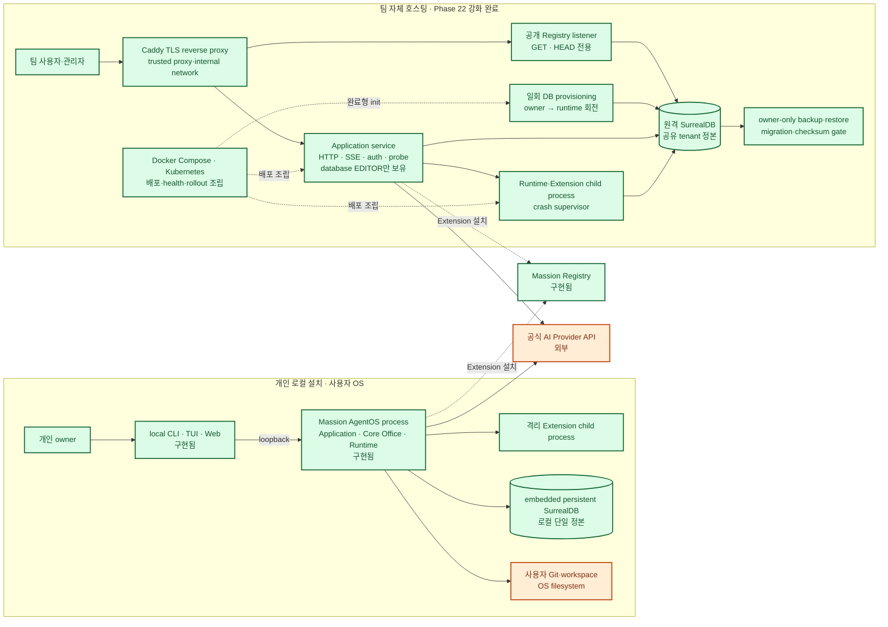

| 배포 변형 | 현재 상태 | 신뢰·운영 경계 |
|---|---|---|
| 개인 로컬 | Application API·CLI·TUI·Web·서버 조립 구현됨 | loopback bootstrap, OS 사용자 권한, 로컬 DB 경로당 단일 연결 |
| 팀 자체 호스팅 | Compose 실행·읽기 전용 Registry·owner/runtime 분리 검증, Kubernetes 1.34 schema 검증 완료 | TLS, database 범위 runtime auth, tenant 격리, shared DB, sandbox gate, backup·restore |
| 관리형 Massion Cloud | 1.0 범위 밖 | 호환 가능한 멀티테넌트 계약만 유지하고 내부 구조는 이 문서에서 설계하지 않음 |

## 12. 구현 위치와 Phase 상태 색인

| 영역 | 상태 | 구현·설계 위치 | Phase |
|---|---|---|---|
| 기반 계약·저장소·Identity·Organization | 구현됨 | `packages/foundation`, `packages/storage`, `packages/identity`, `packages/organization` | 현재 코드 |
| Work·Router·Runtime·Governance | 구현됨 | `packages/work`, `packages/router`, `packages/runtime`, `packages/governance` | 5~8 |
| Context·Evidence·Engineering·Assurance·Records·Growth | 구현됨 | `packages/context-strategy`, `packages/evidence`, `packages/software-engineering`, `packages/assurance`, `packages/records`, `packages/growth` | 9~14 |
| Extension SDK·Host | 구현됨 | `packages/extension-sdk`, `packages/extension-host` | 15 |
| Application API·CLI | 구현됨 | `packages/application`, `apps/cli` | 16 |
| TUI | 구현됨 | `apps/tui` | 17 |
| Web Console | 구현됨 | `apps/web` | 18 |
| Slack·Discord·GitHub 공식 통합 | 구현됨 | `packages/integrations`, `extensions/*` | 19 |
| Registry·Marketplace | 구현됨 | `packages/registry`, `packages/application`, `apps/cli`, `apps/web` | 20 |
| 자체 호스팅·운영 | 구현됨 | `apps/server`, `compose.yaml`, `deploy/kubernetes`, `docs/operations` | 21 |
| 보안·성능·복구 강화 | 구현됨 | `apps/server`, `packages/registry`, `scripts/verify-security.mjs`, `scripts/hardening-load.mjs` | 22 |
| 완제품 E2E·1.0 릴리스 | 구현됨 | `apps/distribution`, `release`, `scripts/build-release.mjs`, `scripts/verify-release.mjs`, `.github/workflows/release.yml` | 23 |
| 모델 평가실·역할별 배치 | 구현 중 | `packages/model-optimization`, `packages/router`, `packages/runtime`, `apps/server`, `apps/cli`, `apps/web`, `apps/tui` | 25 |

이 문서의 상태가 현재 코드와 달라지면 실제 검증 근거를 확인한 뒤 그림과 표를 함께 갱신합니다.

### 검증 기록

2026-07-13 공개 저장소 전환 후 다음 검증을 다시 실행했습니다.

| 검증 | 결과 |
|---|---|
| `pnpm verify:architecture` | Mermaid CLI 11.16.0으로 다이어그램 11개 SVG 렌더링 통과 |
| `node --test scripts/verify-docs.test.mjs` | 문서 검증기 테스트 10개 통과 |
| `node scripts/verify-docs.mjs` | Phase 구조·요구사항 추적표·로컬 링크 검사 통과 |
| `pnpm build` | 29개 workspace package 빌드 통과 |
| `pnpm verify:security` | 보안 테스트 파일 14개, 테스트 67개 통과·1개 조건부 생략, moderate·high·critical advisory 0 |
| `git diff --check` | 공백·충돌 표식 검사 통과 |

로컬 검증 스크립트는 설치된 Chrome·Chromium을 사용합니다. 자동 탐지 경로에 브라우저가 없으면 `MASSION_MERMAID_BROWSER` 환경 변수에 실행 파일 경로를 지정합니다.
