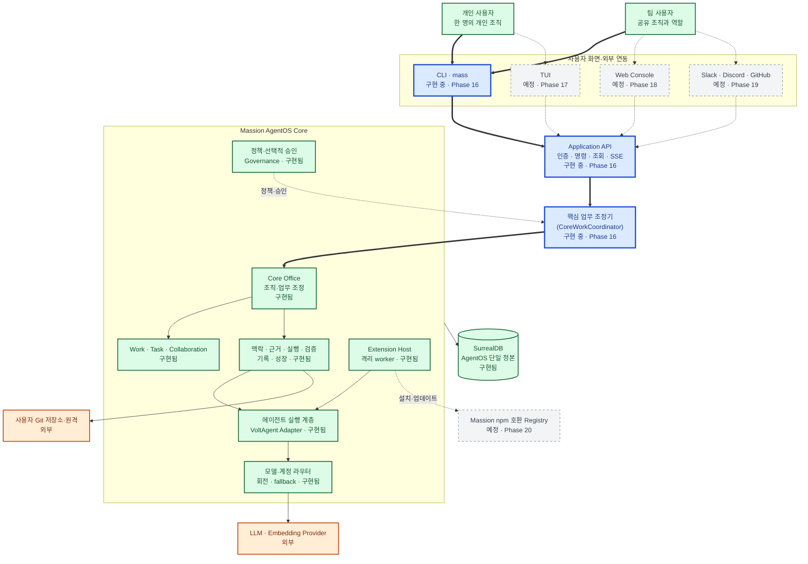
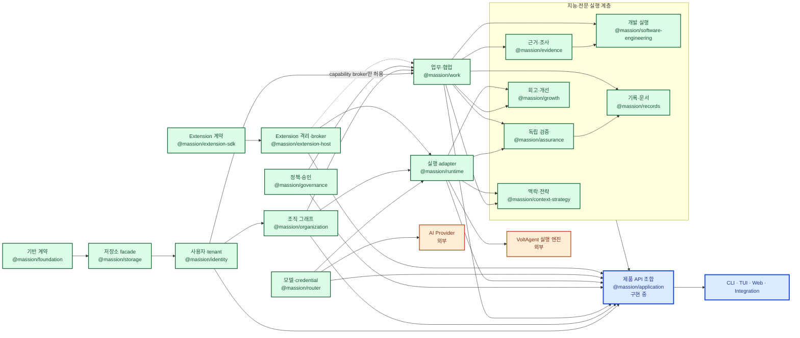

# Massion AgentOS 1.0 전체 아키텍처

> **문서 상태**: 현재 구현 아키텍처 정본
> **기준일**: 2026-07-11
> **기준 커밋**: `7457921`
> **제품 정본**: [Massion 완제품 설계 명세](../product/2026-07-10-complete-product-design.md)
> **진행 정본**: [Massion AgentOS 1.0 프로그램 계획](../superpowers/plans/2026-07-10-massion-agentos-1.0-program.md)

이 문서는 Massion을 처음 접하는 사람과 구현 에이전트가 제품 전체를 빠르게 파악하도록 돕습니다. 승인된 1.0 목표와 현재 코드를 같은 그림에 표시하되 상태를 명확히 구분합니다. 세부 계약은 각 Phase의 설계·구현 계획·회고와 실제 코드가 소유하며, 이 문서는 그 관계를 연결하는 지도입니다.

근거는 제품 정본, 완료된 Phase 회고와 실제 코드·테스트, 구현 중인 Phase 설계와 현재 코드, ADR·검증 자료 순으로 판정합니다. 대체된 과거 개념도는 현재 구조의 근거로 사용하지 않습니다.

## 1. 읽는 법과 상태 범례

| 시각 표현 | 상태 | 의미 |
|---|---|---|
| 녹색 실선·`구현됨` | 구현됨 | 완료된 Phase의 코드·테스트·회고 근거가 있음 |
| 파란색 굵은 실선·`구현 중` | 구현 중 | 코드가 존재하지만 현재 Phase 완료 검증 전 |
| 회색 점선·`예정` | 예정 | 승인된 1.0 범위이나 아직 구현되지 않음 |
| 주황색 이중선·`외부` | 외부 시스템 | Massion이 소유하지 않는 서비스·저장소 |

굵은 화살표는 사용자 Work의 주 실행 경로, 일반 실선은 동기 명령·직접 호출, 점선은 이벤트·관찰·정책 영향을 뜻합니다. 원통은 영속 저장소, 큰 경계 상자는 프로세스 또는 배포 단위입니다. 색상을 볼 수 없는 환경에서도 상태 라벨과 선 모양으로 구분할 수 있습니다.

기준 커밋에서 Phase 0~15는 구현됨, Phase 16은 구현 중, Phase 17~23은 예정입니다. 개별 요소는 Phase 번호만으로 판정하지 않고 실제 코드와 검증 결과를 함께 확인합니다.

## 2. 전체 시스템 지도

Massion은 사용자 요청을 일회성 채팅이 아닌 영속 업무(Work)로 만들고, 조직이 계획·조사·실행·검증·기록·개선을 분담하는 AgentOS입니다. CLI·TUI·Web·외부 Surface는 같은 Application API와 상태를 사용합니다.

| 요소 | 상태 | 실제 위치 | 근거 |
|---|---|---|---|
| CLI·Application API | 구현 중 | `apps/cli`, `packages/application` | [Phase 16 설계](../phases/16-application-api-cli/design.md) |
| Core Office·Work·Governance | 구현됨 | `packages/organization`, `packages/work`, `packages/governance` | [Phase 4 회고](../phases/04-organization-graph-core-office/review.md), [Phase 5 회고](../phases/05-work-collaboration-records/review.md), [Phase 8 회고](../phases/08-governance-approval/review.md) |
| Runtime·Router | 구현됨 | `packages/runtime`, `packages/router` | [Phase 6 회고](../phases/06-provider-credential-router/review.md), [Phase 7 회고](../phases/07-voltagent-runtime-adapter/review.md) |
| Extension Host | 구현됨 | `packages/extension-host` | [Phase 15 회고](../phases/15-extension-sdk-host/review.md) |
| TUI·Web·외부 Surface·Registry | 예정 | `docs/superpowers/plans/2026-07-10-massion-agentos-1.0-program.md` | 프로그램 Phase 17~20 |
| SurrealDB 단일 정본 | 구현됨 | `packages/storage` | [Phase 2 회고](../phases/02-surrealdb-source-of-truth/review.md) |

## 3. 제품 구성요소와 패키지 경계

각 패키지는 자신이 소유한 도메인 불변량을 검사합니다. Application 계층은 공개 서비스를 조합하지만 Work revision, tenant 격리, 정책, 승인, 증거 계보를 대신 판정하지 않습니다. VoltAgent는 실행 메커니즘이며 Massion의 공개 계약으로 노출되지 않습니다.

| 경계 | 규칙 | 실제 위치 |
|---|---|---|
| 데이터 | SurrealDB SDK 타입은 저장소 facade 위 도메인 계약에 노출하지 않음 | `packages/storage` |
| 실행 | VoltAgent 타입은 Runtime adapter 내부에 격리 | `packages/runtime` |
| 제품 API | 도메인 공개 서비스만 조합하고 raw store를 반환하지 않음 | `packages/application` |
| Extension | worker는 capability broker만 사용하고 Database·credential에 직접 접근하지 않음 | `packages/extension-sdk`, `packages/extension-host` |

## 4. Core Office와 전문 조직

Core Office의 불변 조직과 전문 조직·Extension 조직의 차이를 설명합니다.

## 5. Work 처리 전체 흐름

모든 요청이 Work가 되어 계획·근거·실행·검증·기록·개선으로 이어지는 경로를 설명합니다.

## 6. 실행·승인·차단·취소·복구

자동 실행과 선택적 사람 승인, 모델 부재, 취소, 장애 복구를 성공과 구분해 설명합니다.

## 7. 에이전트 협업과 대화

조직 Agent map, 협업방, 직접·다자 대화와 병렬 실행의 Work 귀속 관계를 설명합니다.

## 8. 모델 계정·Provider 라우팅

동일 Provider의 여러 계정 회전과 동급 모델·다른 Provider fallback 정책을 설명합니다.

## 9. 데이터·명령·이벤트 계보

명령 replay, 도메인 transaction, outbox, 공개 이벤트와 SSE cursor 계보를 설명합니다.

## 10. Extension·Registry·격리

Extension 작성부터 검증·배포·격리 실행·업데이트·rollback까지의 신뢰 경계를 설명합니다.

## 11. 개인·팀 배포 구조

OS 위 개인 로컬 설치와 팀 자체 호스팅의 프로세스·네트워크 경계를 설명합니다.

## 12. 구현 위치와 Phase 상태 색인

| 영역 | 상태 | 구현·설계 위치 | Phase |
|---|---|---|---|
| 제품 헌법·품질·저장소·Identity·Organization | 구현됨 | `docs/phases/00-document-lineage` ~ `docs/phases/04-organization-graph-core-office` | 0~4 |
| Work·Router·Runtime·Governance | 구현됨 | `packages/work`, `packages/router`, `packages/runtime`, `packages/governance` | 5~8 |
| Context·Evidence·Engineering·Assurance·Records·Growth | 구현됨 | `packages/context-strategy`, `packages/evidence`, `packages/software-engineering`, `packages/assurance`, `packages/records`, `packages/growth` | 9~14 |
| Extension SDK·Host | 구현됨 | `packages/extension-sdk`, `packages/extension-host` | 15 |
| Application API·CLI | 구현 중 | `packages/application`, `apps/cli` | 16 |
| TUI·Web·외부 Surface·Registry·운영·강화·1.0 | 예정 | `docs/superpowers/plans/2026-07-10-massion-agentos-1.0-program.md` | 17~23 |

이 문서의 상태가 프로그램 계획과 달라지면 실제 검증 근거를 확인한 뒤 그림, 표와 기준 커밋을 함께 갱신합니다.
