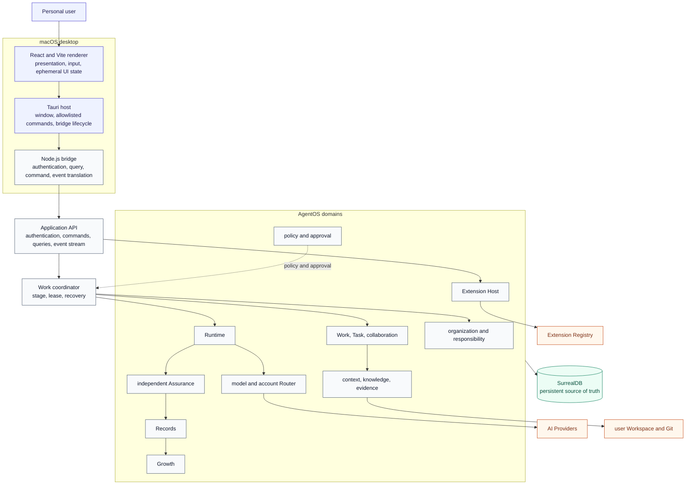
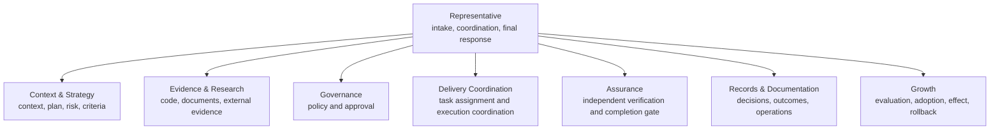
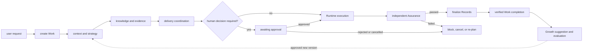
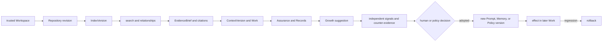
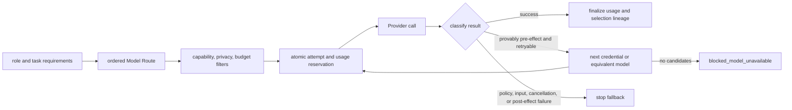
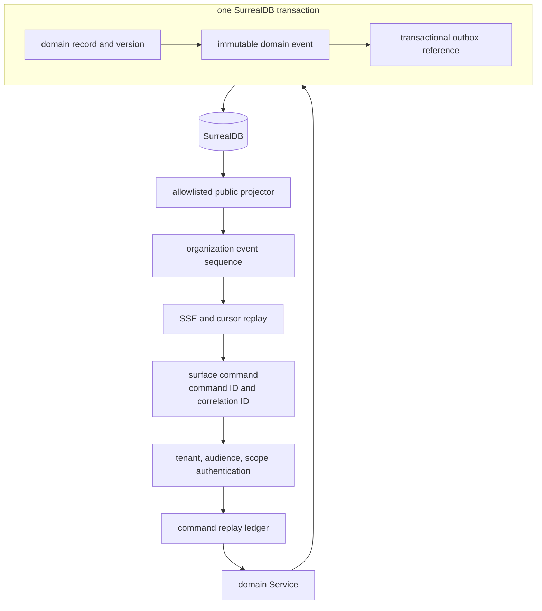
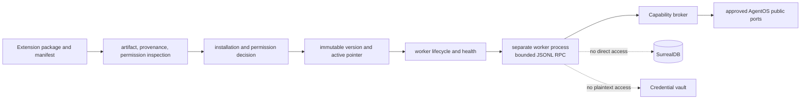

# Massion AgentOS Architecture

[English](README.md) | [한국어](README.ko.md)

This document explains Massion's components, responsibility boundaries, and data flow. The [Product Constitution](../product/constitution.md) owns purpose and invariants, the [repository README](../../README.md) owns the public release boundary, and [verification evidence](../evidence/) owns runtime results.

Architecture does not declare implementation status. Source paths identify ownership; they do not prove user acceptance or a public release.

## 1. Design principles

1. **Work is the source of truth.** Conversation and model transcripts are interfaces. Persistent Work and immutable events determine execution, recovery, and completion.
2. **Each domain owns its invariants.** The Application layer composes services but does not replace tenant, revision, approval, Assurance, or lineage checks.
3. **Execution engines and Providers are replaceable boundaries.** VoltAgent and model-specific types do not become public product contracts.
4. **Completion requires independent Assurance.** A successful response from the executing actor cannot complete Work by itself.
5. **Growth preserves version, evaluation, effect, and rollback.** A suggestion cannot immediately become active policy.
6. **SurrealDB is the persistent source of truth.** UI and process memory are reconstructable projections.
7. **Secrets and authority shrink across process boundaries.** Renderers and Extensions do not directly receive access tokens, raw credentials, or database access.

## 2. System map

The first public boundary is a personal desktop AgentOS operated by one user on their own Mac.

```mermaid
flowchart TB
  classDef surface fill:#eef2ff,stroke:#4338ca,color:#1e1b4b;
  classDef core fill:#f8fafc,stroke:#475569,color:#0f172a;
  classDef storage fill:#ecfdf5,stroke:#047857,color:#064e3b;
  classDef external fill:#fff7ed,stroke:#c2410c,color:#7c2d12;

  User["Personal user"]:::surface

  subgraph Desktop["macOS desktop"]
    Renderer["React and Vite renderer<br/>presentation, input, ephemeral UI state"]:::surface
    Host["Tauri host<br/>window, allowlisted commands, bridge lifecycle"]:::surface
    Bridge["Node.js bridge<br/>authentication, query, command, event translation"]:::core
  end

  API["Application API<br/>authentication, commands, queries, event stream"]:::core
  Coordinator["Work coordinator<br/>stage, lease, recovery"]:::core

  subgraph AgentOS["AgentOS domains"]
    Organization["organization and responsibility"]:::core
    Work["Work, Task, collaboration"]:::core
    Governance["policy and approval"]:::core
    Knowledge["context, knowledge, evidence"]:::core
    Runtime["Runtime"]:::core
    Assurance["independent Assurance"]:::core
    Records["Records"]:::core
    Growth["Growth"]:::core
    Router["model and account Router"]:::core
    Extensions["Extension Host"]:::core
  end

  DB[("SurrealDB<br/>persistent source of truth")]:::storage
  Providers["AI Providers"]:::external
  Files["user Workspace and Git"]:::external
  Registry["Extension Registry"]:::external

  User --> Renderer
  Renderer --> Host
  Host --> Bridge
  Bridge --> API
  API --> Coordinator
  Coordinator --> Organization
  Coordinator --> Work
  Governance -. "policy and approval" .-> Coordinator
  Work --> Knowledge
  Knowledge --> Files
  Coordinator --> Runtime
  Runtime --> Router
  Router --> Providers
  Runtime --> Assurance
  Assurance --> Records
  Records --> Growth
  API --> Extensions
  Extensions --> Registry
  AgentOS --> DB
```

Arrows show call direction and influence. External boundaries are accounts, files, and services that Massion does not own.

## 3. Package responsibility

| Responsibility | Owner | Boundary |
|---|---|---|
| Shared identifiers and contracts | `packages/foundation` | Values and errors independent from a domain |
| Database facade and migrations | `packages/storage` | SurrealDB SDK types stay below domain contracts |
| User and tenant isolation | `packages/identity` | Tenant context for every persistent read and write |
| Organization graph | `packages/organization` | Roles, relationships, versions, and organizational change |
| Work and collaboration | `packages/work` | Work state, revision, messages, and artifacts |
| Policy and approval | `packages/governance` | Action permission, human decisions, and impact |
| Model and account selection | `packages/router` | Candidate filtering, credentials, budget, fallback, and attempts |
| Agent execution | `packages/runtime` | Execution, resume, cancellation, sessions, and usage |
| Context and strategy | `packages/context-strategy` | ContextVersion, plan, and completion criteria |
| Code and document knowledge | `packages/evidence` | Repository, index, search, relationships, and EvidenceBrief |
| Software delivery | `packages/software-engineering` | Isolated Workspace, TDD delivery, and recovery |
| Independent assurance | `packages/assurance` | Criteria, checks, findings, and completion judgment |
| Records | `packages/records` | WorkRecord, ADR, change, and operations records |
| Growth | `packages/growth` | Suggestion, evaluation, adoption, effect, and rollback |
| Public product API | `packages/application` | Authenticated queries, commands, and events |
| Server composition | `apps/server` | Domain services and external adapters |
| Desktop | `apps/desktop` | Surface, Tauri, bridge, and local lifecycle |

A package does not mutate another domain's raw store. A cross-domain atomic transition uses an explicit port and one database transaction.

## 4. Organization and responsibility

Core Office fixes responsibilities, not department names.

```mermaid
flowchart TB
  Representative["Representative<br/>intake, coordination, final response"]
  Strategy["Context & Strategy<br/>context, plan, risk, criteria"]
  Evidence["Evidence & Research<br/>code, documents, external evidence"]
  Governance["Governance<br/>policy and approval"]
  Delivery["Delivery Coordination<br/>task assignment and execution coordination"]
  Assurance["Assurance<br/>independent verification and completion gate"]
  Records["Records & Documentation<br/>decisions, outcomes, operations"]
  Growth["Growth<br/>evaluation, adoption, effect, rollback"]

  Representative --> Strategy
  Representative --> Evidence
  Representative --> Governance
  Representative --> Delivery
  Representative --> Assurance
  Representative --> Records
  Representative --> Growth
```

Organization nodes represent persistent responsibility and authority. Model processes run when Work needs them; their lifetime is not the lifetime of an organization node. Specialist organizations and temporary teams provide execution capability without replacing Core Office responsibilities.

## 5. Work flow

Software and non-software Work may use different delivery mechanisms while sharing the same completion boundary.

```mermaid
flowchart LR
  Request["user request"] --> Intake["create Work"]
  Intake --> Context["context and strategy"]
  Context --> Knowledge["knowledge and evidence"]
  Knowledge --> Delivery["delivery coordination"]
  Delivery --> Approval{"human decision required?"}
  Approval -->|no| Execute["Runtime execution"]
  Approval -->|yes| Review["awaiting approval"]
  Review -->|approved| Execute
  Review -->|rejected or cancelled| Replan["block, cancel, or re-plan"]
  Execute --> Verify["independent Assurance"]
  Verify -->|passed| Record["finalize Records"]
  Verify -->|failed| Replan
  Record --> Complete["verified Work completion"]
  Complete --> Growth["Growth suggestion and evaluation"]
  Growth -. "approved new version" .-> Context
```

### Terminal meaning

| State | Meaning | Next action |
|---|---|---|
| `completed` | Ended after Assurance and Records | Inspect artifacts, assurance, and records |
| `awaiting-approval` | Paused for a human decision | Review evidence and approve or reject |
| `blocked` | A recoverable condition is missing | Restore Provider, policy, or input and resume |
| `failed` | Automatic recovery is not possible | Diagnose and start an explicit recovery or new run |
| `cancelled` | The user stopped execution | Preserve history and allow a new run |

An Application run persists its stage, lease generation, and deterministic command IDs. Restart resumes from stored state and must not repeat an already committed external effect.

## 6. Knowledge and Growth

Knowledge exposes file, document, symbol, artifact, and Work relationships in a Workspace. It does not replace Work. Every citation remains bound to Repository and IndexVersion lineage.

```mermaid
flowchart LR
  Workspace["trusted Workspace"] --> Repository["Repository revision"]
  Repository --> Index["IndexVersion"]
  Index --> Search["search and relationships"]
  Search --> Brief["EvidenceBrief and citations"]
  Brief --> Work["ContextVersion and Work"]
  Work --> Outcome["Assurance and Records"]
  Outcome --> Suggestion["Growth suggestion"]
  Suggestion --> Evaluation["independent signals and counter-evidence"]
  Evaluation --> Decision{"human or policy decision"}
  Decision -->|adopted| Version["new Prompt, Memory, or Policy version"]
  Version --> Effect["effect in later Work"]
  Effect -->|regression| Revert["rollback"]
```

Growth never rewrites past Work. New versions apply to later runs and preserve causal Work, Evidence, evaluation receipts, effect observations, and rollback.

## 7. Providers and Runtime

Users connect Provider accounts but do not manually select a model for every Work. Strategy and role policy establish allowed candidates; the Router applies capability, data policy, budget, account health, and evaluation evidence.

```mermaid
flowchart LR
  Need["role and task requirements"] --> Route["ordered Model Route"]
  Route --> Filter["capability, privacy, budget filters"]
  Filter --> Reserve["atomic attempt and usage reservation"]
  Reserve --> Call["Provider call"]
  Call --> Result{"classify result"}
  Result -->|success| Commit["finalize usage and selection lineage"]
  Result -->|provably pre-effect and retryable| Fallback["next credential or equivalent model"]
  Fallback --> Reserve
  Result -->|policy, input, cancellation, or post-effect failure| Stop["stop fallback"]
  Fallback -->|no candidates| Blocked["blocked_model_unavailable"]
```

Credential plaintext never appears in events, errors, or surfaces. Fallback is permitted only when failure before output or tool effects can be established. The actual profile, credential, batch, and usage remain attached to the route attempt.

## 8. Commands, events, and recovery

```mermaid
flowchart TB
  Surface["surface command<br/>command ID and correlation ID"] --> Auth["tenant, audience, scope authentication"]
  Auth --> Ledger["command replay ledger"]
  Ledger --> Domain["domain Service"]

  subgraph Transaction["one SurrealDB transaction"]
    Record["domain record and version"] --> Event["immutable domain event"]
    Event --> Outbox["transactional outbox reference"]
  end

  Domain --> Transaction
  Transaction --> DB[("SurrealDB")]
  DB --> Projector["allowlisted public projector"]
  Projector --> Sequence["organization event sequence"]
  Sequence --> Stream["SSE and cursor replay"]
  Stream --> Surface
```

- The same command ID and canonical request replay the stored result.
- A different request under the same command ID is rejected.
- Failure of record, event, or outbox rolls back the whole transaction.
- Public projection emits allowlisted fields and never returns raw rows or secrets.
- Reconnect replays events after the organization's cursor in order.

## 9. Extension trust boundary

Extensions add capability without receiving direct Core process, database, or credential ownership.

```mermaid
flowchart LR
  Package["Extension package and manifest"] --> Inspect["artifact, provenance, permission inspection"]
  Inspect --> Governance["installation and permission decision"]
  Governance --> Store["immutable version and active pointer"]
  Store --> Supervisor["worker lifecycle and health"]
  Supervisor --> Worker["separate worker process<br/>bounded JSONL RPC"]
  Worker --> Broker["Capability broker"]
  Broker --> Ports["approved AgentOS public ports"]
  Worker -. "no direct access" .-> DB[("SurrealDB")]
  Worker -. "no plaintext access" .-> Vault["Credential vault"]
```

Activation preserves artifact, manifest, provenance, and approval lineage. A worker can request only the intersection of declared capability and exposed public ports. Disable, update, and rollback do not alter historical Work.

## 10. Desktop process boundary

| Layer | Responsibility | Forbidden |
|---|---|---|
| React renderer | Presentation, input, accessibility, ephemeral UI state | Token storage, direct daemon access, general native APIs |
| Tauri host | Window, allowlisted IPC, native picker, bridge lifecycle | External Web URLs, general shell/filesystem access, domain decisions |
| Node.js bridge | Daemon availability, authentication, query/command/event translation | Raw secret/header/stack transfer, arbitrary command execution |
| Massion daemon | Application API, domains, Runtime, persistent state | Desktop-only presentation state |

The renderer does not receive the daemon URL or access token. Tauri capabilities expose only required commands. Bridge messages enforce size, schema, and concurrency limits. Closing the app window does not destroy persistent Work or daemon-owned data.

The personal 1.0 target is macOS arm64 desktop. CLI, Web, TUI, Compose, and Kubernetes paths in the repository are separate operational or historical boundaries and do not define personal release acceptance.

## 11. Decisions and evidence

- [Personal full-access execution](ADR-001-personal-full-access.md)
- [Knowledge axis and surface](ADR-002-knowledge-axis-restoration.md)
- [Task-aware model placement](ADR-003-task-aware-model-placement.md)
- [Independent desktop transition](desktop-clean-sheet.md)
- [Desktop design language](../../apps/desktop/DESIGN.md)
- [Documentation map](../README.md)
- [Verification evidence](../evidence/)

Record architecture changes as ADRs. Judge runtime behavior and release readiness only from evidence executed on the same candidate SHA.
