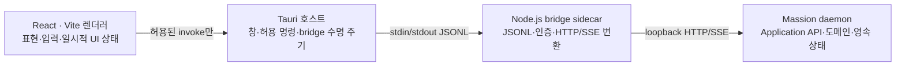

# ADR — 조직·Work·성장을 운영하는 독립 AgentOS 데스크톱으로 전환

[English](desktop-clean-sheet.md) | [한국어](desktop-clean-sheet.ko.md)

> **상태**: 승인된 아키텍처 결정
> **결정일**: 2026-07-22
> **대상 독자**: 데스크톱·Application API·릴리스 구현자와 검토자
> **대체하는 결정**: Web·GUI 래퍼 공유 아키텍처
> **제품 기준**: [Massion 제품 헌법과 현재 방향](../product/constitution.ko.md)

## 결정

Massion 데스크톱은 `apps/web`을 감싸는 래퍼(wrapper)가 아니라 `apps/desktop`이 화면과 수명 주기를 소유하는 독립 AgentOS 앱으로 구현합니다. 기존 Web·Studio·TUI의 화면 코드, 시각 자산, 레이아웃은 재사용하지 않습니다. 이미 검증된 도메인 규칙과 Application API 계약은 재사용합니다.

첫 릴리스 대상은 macOS arm64입니다. 앱은 다음 네 부분으로 나눕니다.

렌더러는 daemon URL이나 인증 토큰을 받지 않습니다. Tauri는 범용 셸(shell)·파일시스템(filesystem) 권한을 렌더러에 제공하지 않습니다. Node.js bridge만 로컬 daemon을 보장하고 Application API의 조회(query), 명령(command), 사건 스트림(event stream)을 제한된 메시지 계약으로 전달합니다.

## 대체한 구조와 결정 이유

전환 작업 시작 기준선(`c98d78b991e9`, 2026-07-22)의 데스크톱은 독립 앱이 아닙니다.

- `apps/desktop/package.json`은 화면 소유자를 `apps/web`으로 선언합니다.
- `apps/desktop/src-tauri/tauri.conf.json`은 `../fallback`, `withGlobalTauri: true`, `csp: null`을 사용합니다.
- `apps/desktop/src-tauri/capabilities/default.json`은 loopback 원격 URL에 native capability를 엽니다.
- `apps/desktop/src-tauri/src/lib.rs`는 `WebviewUrl::External`로 Web Console을 로드하고 인증 쿠키를 `document.cookie`로 주입합니다.
- `scripts/build-release.mjs`는 `apps/web/dist`를 로컬 릴리스에 복사하고, 배포용 Caddy 이미지도 Web 빌드에 의존합니다.
- 현재 릴리스 manifest와 구독 UAT는 TUI 산출물을 참조합니다.

이 구조에서는 Work 관제 화면과 데스크톱 프로세스 수명 주기를 바꿀 때마다 Web 인증·원격 URL·native capability 주입을 함께 유지해야 합니다. 새 제품은 Work 활동뿐 아니라 조직 편성, 결정, 성장과 역량 확장을 하나의 AgentOS에서 다뤄야 하므로 화면 자체와 로컬 실행 경계를 같은 제품 단위에서 검증할 수 있어야 합니다. 따라서 기존 화면에 기능을 덧붙이는 방식은 종료하고, 도메인 계약 아래에서만 재사용 경계를 둡니다.

## 책임 경계

| 구성요소 | 소유 책임 | 금지 사항 |
|---|---|---|
| React 렌더러 | 4영역 레이아웃, 입력 상태, 접근성, Application DTO 표현 | 토큰 저장, daemon 직접 접속, 범용 native API, 도메인 상태 판정 |
| Tauri 호스트 | 창 설정, bridge 시작·종료, 고정된 native 명령, IPC 입력 검증 | 외부 Web URL 로드, 쿠키 주입, 범용 shell/fs 노출, 업무 규칙 |
| Node.js bridge | daemon 확인·기동, 인증 보관, 요청 상관관계, SSE 재연결, 오류 정제 | 화면 상태, raw secret·header·stack 전달, 임의 명령 실행 |
| Massion daemon | Application API, 권한, revision, Work·Run·Approval 정본 | 데스크톱 전용 표현 상태 |

Tauri v2는 capability 파일로 창별 IPC 권한을 제한하고, 콘텐츠 보안 정책(Content Security Policy, CSP)을 설정할 수 있습니다. 여러 capability가 한 웹뷰에 겹치면 권한이 합쳐지므로 이 프로젝트는 `app.security.capabilities`에 사용할 식별자를 명시합니다. sidecar는 번들 설정의 `externalBin`으로 선언하되 Tauri 호스트가 시작하고, 렌더러에는 `shell:allow-spawn`을 포함한 shell 권한을 열지 않습니다.

bridge 런타임은 2026-07-22 현재 Active LTS인 공식 Node.js 24.18.0 macOS arm64 바이너리를 정확한 버전으로 고정합니다. 빌드 입력에서 공식 SHA-256과 서명을 검증합니다. 단일 실행 파일 애플리케이션(Single Executable Application, SEA)은 아직 활성 개발 단계이고 단일 CommonJS 스크립트 제약이 있으므로 첫 릴리스 패키징에 사용하지 않습니다.

## 정보 구조와 시각 구현 경계

하나의 업무를 선택한 상세 화면은 Work를 중심으로 한 네 영역입니다.

1. 전역 레일: 대표·홈, 업무, 조직, 결정, 성장, 역량, 설정으로 이동합니다.
2. Work 목록: 생성, 검색, 상태 필터, 선택을 담당합니다.
3. Work 활동: 요청부터 계획, 실행, 승인, 산출물, 검증까지 실제 사건 순서를 표시하고 후속 지시를 받습니다.
4. 검사기(inspector): 선택한 Work의 작업, 담당 에이전트, 검증 상태를 교차 확인합니다.

Work 상세의 네 영역을 AgentOS 전체 정보 구조로 확대 해석하지 않습니다. `결정`은 실행 승인과 조직·자기수정 결정을 통합하고, `성장`은 Reflection·Suggestion·Effect·Revert를 별도 제품 표면으로 제공합니다. `역량`은 설치 패키지보다 조직에 추가된 Skill·Tool·MCP·Extension Capability를 우선 표시하며 Registry 검색·검토·승인·설치를 제공합니다. `설정`은 Provider·계정 인증·모델 경로·실행 정책과 로컬 운영 환경을 별도 표면에서 구성합니다. 실행 자동화 수준은 별도 전역 제품 축이 아니라 설정이 투영하는 실행·성장 정책입니다.

전역 Sidebar는 확장 224px, 아이콘 모드 64px를 기본값으로 사용합니다. 표면 내부 패널은 모든 화면에 같은 열 비율을 강제하지 않고 Resizable의 표면별 기본값과 최소 폭을 사용합니다. Work의 초기값은 목록 248px, 본문 가변, Inspector 320px이며 사용자가 조절한 비율을 로컬 UI 환경설정으로 보존합니다. 최소 창 크기는 1180×720px이고 이 폭에서는 Sidebar가 아이콘 모드가 되며 Inspector를 접을 수 있습니다. 각 영역은 독립적으로 스크롤합니다. 모바일용 축소 레이아웃은 첫 릴리스 범위가 아닙니다.

shadcn/ui는 공통 셸과 접근성 상호작용의 소스 공급 방식으로 적극 사용합니다. 제공된 코드는 `apps/desktop`이 직접 소유·검토·수정하며 `--all`이나 `--overwrite`로 일괄 추가하지 않습니다. 공통 셸에는 Sidebar, Resizable, ScrollArea, Separator, Command와 필요할 때만 Sheet를 사용합니다. 데이터 표면에는 Item/Table, Tabs, Badge, Progress, Accordion, Empty, Skeleton과 Alert를 사용하고, 설정에는 Field, Input, Select와 Switch를 사용합니다. 승인·권한·삭제에는 Dialog와 AlertDialog를 사용합니다. Card는 실제로 독립된 요약 경계에만 제한합니다. 제품은 단일 암갈색 배경, 한 가지 amber 강조색, 제한된 border·radius 계층과 정보 구조를 계속 직접 소유합니다.

## 보안과 데이터 흐름 규칙

- `frontendDist`는 번들된 독립 렌더러만 가리키며 HTTP(S) URL과 fallback wrapper를 허용하지 않습니다.
- `withGlobalTauri`는 끄고, 렌더러는 `@tauri-apps/api`의 허용된 invoke만 사용합니다.
- CSP는 `default-src 'self'`를 기준으로 필요한 directive만 추가합니다. Tauri의 nonce/hash 자동 보강을 유지하고 `unsafe-eval`, 원격 script, 임의 원격 origin은 허용하지 않습니다.
- `app.security.capabilities`는 포함할 capability 식별자를 명시합니다. capability에는 `remote.urls`, `shell:*`, `fs:*`를 두지 않습니다. 폴더 선택이 필요하면 dialog와 결과 경로 검증을 결합한 전용 명령만 제공합니다.
- bridge 메시지는 크기 제한, 요청 수 제한, schema 검증을 통과해야 합니다. 오류 응답에는 token, HTTP header, stack trace를 포함하지 않습니다.
- 앱 종료 시 bridge는 종료하지만 daemon은 유지합니다. daemon의 생명 주기는 앱 창과 동일하지 않습니다.
- Work revision과 approval revision 충돌은 UI에서 추측해 덮어쓰지 않고 Application API 오류로 표시한 뒤 다시 조회합니다.

## 전환 단계와 삭제 조건

| 단계 | 변경 | 통과 조건 | 삭제 대상 |
|---|---|---|---|
| 0. 경계 고정 | 독립성 회귀 검사 추가, 기존 Web 동결 | `node --test scripts/desktop-boundary.test.mjs`가 목표 위반을 정확히 보고 | 없음 |
| 1. 독립 shell | React/Vite 렌더러와 보안 Tauri 설정 연결 | desktop build·typecheck·component test, CSP·capability 검사 통과 | `apps/desktop/fallback`, 외부 URL·쿠키 주입 코드 |
| 2. 로컬 연결 | Node.js bridge와 daemon manager 연결 | handshake, query, command, SSE 재연결, 종료 동작 테스트 통과 | `massion --web` 세션을 통한 desktop bootstrap |
| 3. Work 세로 흐름 | 생성·선택·검색·필터, 실제 활동, 승인, 산출물, 검증, 후속 지시 연결 | fixture가 아닌 로컬 daemon UAT와 접근성 점검 통과 | desktop 내부 임시 fixture adapter |
| 4. AgentOS 표면 | 대표·홈, 조직 변경, 결정, 성장, 역량을 실제 도메인 흐름에 연결 | 승인된 제품 목업, 동적 조직·Growth 세로 흐름 통과 | 읽기 전용 조직·자동화·설치 목록 임시 화면 |
| 5. macOS arm64 릴리스 | stock Node.js와 필요한 runtime을 sidecar/resource로 번들 | 깨끗한 macOS arm64 환경에서 설치·시작·Work 완료·재시작 검증 | 구형 local release의 Web/TUI 진입 경로 |
| 6. 구형 화면 정리 | release·배포·문서 의존성 제거 | 아래 삭제 gate가 모두 통과 | `apps/web`, `apps/tui`, 사용되지 않는 `apps/studio` |

구형 화면 디렉터리는 다음 gate를 모두 통과한 뒤 별도 변경으로 삭제합니다.

- `scripts/build-release.mjs`, 설치 테스트, 구독 UAT, Caddy 배포에서 해당 산출물 참조가 제거되거나 명시적으로 별도 제품으로 이전됩니다.
- CLI 기본 진입점과 릴리스 manifest가 새 데스크톱 또는 지원되는 headless 흐름만 가리킵니다.
- 문서와 보안·릴리스 검사가 새 경로를 검증하며 전체 `pnpm verify`가 통과합니다.
- macOS arm64 설치 UAT의 증거가 남고 rollback 가능한 직전 릴리스가 보존됩니다.
- 사용자 소유의 untracked 파일인 `apps/studio/driver.mjs`는 자동 정리하지 않습니다. 소유자가 보존·이동·삭제를 결정한 뒤 처리합니다.

## 전환 수용 기준

- [ ] 독립성 회귀 검사 GREEN
- [ ] `@massion/desktop` build·typecheck·test가 실제 명령을 실행
- [ ] Tauri Rust test와 macOS arm64 build 통과
- [ ] bridge JSONL 경계의 크기·동시 요청·비밀정보 정제 검사 통과
- [ ] Work 생성부터 최종 검증까지 실제 daemon 세로 흐름 통과
- [ ] 동적 조직 제안·승인·적용·Work 배정 세로 흐름 통과
- [ ] Growth 제안·채택·효과 비교·되돌리기 세로 흐름 통과
- [ ] 키보드 이동, focus 표시, 대화상자 label, 명암 대비 점검 통과
- [ ] 앱 재시작 후 Work 선택·활동 cursor 복구 확인
- [ ] release artifact의 외부 Web URL·구형 UI 참조 부재 확인

## 결과와 제외 범위

이 결정으로 Desktop과 Web의 화면 중복 가능성은 받아들입니다. 대신 데스크톱의 보안 경계, 로컬 프로세스 수명 주기와 조직·Work·성장 운영 UX를 한 배포 단위에서 테스트할 수 있습니다.

관리형 Cloud, Windows/Linux 패키지, 자동 업데이트, mobile layout은 이 결정에 포함하지 않습니다. 실제 요구와 릴리스 기준이 생길 때 별도 ADR로 추가합니다.

## 근거

외부 근거 확인일은 2026-07-22이며 공식 프로젝트 문서만 사용했습니다.

- 저장소 경계 검사: [`scripts/desktop-boundary.test.mjs`](../../scripts/desktop-boundary.test.mjs)
- Tauri v2 [Capabilities](https://v2.tauri.app/security/capabilities/), [Permissions](https://v2.tauri.app/security/permissions/), [Content Security Policy](https://v2.tauri.app/security/csp/), [Sidecar](https://v2.tauri.app/develop/sidecar/), [`withGlobalTauri` 설정](https://v2.tauri.app/reference/config/#appconfig)
- Node.js [Release schedule](https://github.com/nodejs/Release), [24.18.0 release](https://nodejs.org/en/blog/release/v24.18.0), [공식 v24 배포 인덱스](https://nodejs.org/dist/latest-v24.x/), [SEA](https://nodejs.org/download/release/latest-v24.x/docs/api/single-executable-applications.html)
- shadcn/ui [Documentation](https://ui.shadcn.com/docs), [CLI](https://ui.shadcn.com/docs/cli)
