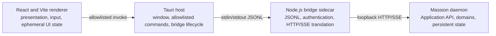

# ADR — An Independent AgentOS Desktop for Organization, Work, and Growth

[English](desktop-clean-sheet.md) | [한국어](desktop-clean-sheet.ko.md)

> **Status:** Accepted architecture decision
> **Decision date:** 2026-07-22
> **Audience:** Desktop, Application API, and release engineers and reviewers
> **Supersedes:** the shared Web/GUI wrapper architecture

## Decision

The Massion desktop is an independent AgentOS application that owns its surface and lifecycle in `apps/desktop`. It is not a wrapper around `apps/web`. Domain rules and Application API contracts remain reusable; legacy Web, Studio, and TUI presentation code and assets do not define the desktop.

The first release target is macOS arm64 and has four process layers.

The renderer never receives the daemon URL or authentication token. Tauri does not expose general shell or filesystem permissions. The bridge owns daemon availability and bounded protocol translation; the daemon owns product state.

## Why this replaces the wrapper

A remote Web view couples desktop product changes to Web authentication, remote URL policy, native capability injection, and legacy distribution artifacts. Massion needs to verify Work, organization, decisions, Growth, Provider supply, Knowledge, and local lifecycle as one desktop product boundary.

Reusing the domain and Application contracts below that boundary keeps the product model stable without preserving the old surface.

## Responsibility boundary

| Component | Owns | Must not own |
|---|---|---|
| React renderer | Layout, input state, accessibility, DTO presentation | Tokens, direct daemon access, general native APIs, domain decisions |
| Tauri host | Window, bridge start/stop, fixed native commands, IPC validation | External Web URLs, cookie injection, general shell/filesystem access, Work rules |
| Node.js bridge | Daemon lifecycle coordination, authentication, correlation, SSE reconnect, error redaction | UI state, raw secrets/headers/stacks, arbitrary execution |
| Massion daemon | Application API, authority, revision, Work, Run, Approval, persistent state | Desktop-only presentation state |

Tauri capability identifiers are explicit. Multiple overlapping capability files are avoided because their permissions combine. A native picker is exposed through one bounded command that validates its result, not through a general filesystem permission.

## Information architecture

Work detail uses four functional areas:

1. global surface rail;
2. Work list;
3. collaboration and activity stream; and
4. contextual inspector.

This Work layout is not the entire AgentOS information architecture. Knowledge, Organization, Growth, Extensions, Providers, Budget, and Settings retain their own question and share the same shell rhythm only where it improves orientation.

The minimum window is 1180×720. At that width the rail may collapse to icons and the context panel may close. Each column scrolls independently. Mobile layout is outside the first release boundary.

## Security and data flow

- `frontendDist` points only to the bundled renderer; HTTP(S) and fallback wrappers are rejected.
- `withGlobalTauri` remains disabled.
- CSP begins from `default-src 'self'` and does not add `unsafe-eval`, remote scripts, or arbitrary remote origins.
- Tauri capabilities do not expose `remote.urls`, `shell:*`, or `fs:*` to the renderer.
- Bridge messages enforce size, concurrency, and schema limits; errors exclude tokens, headers, and stacks.
- Closing the app terminates the bridge but does not equate window lifetime with daemon or data lifetime.
- Revision conflicts are displayed and re-read rather than guessed or overwritten by the UI.

## Transition stages

| Stage | Change | Acceptance | Retired dependency |
|---|---|---|---|
| 0. Boundary | Add independence checks and freeze the old Web surface | Boundary test reports each forbidden dependency | none |
| 1. Shell | Connect React/Vite and secure Tauri configuration | Desktop build, typecheck, component tests, CSP and capability checks | fallback wrapper and external URL loading |
| 2. Local connection | Connect the Node bridge and daemon manager | handshake, query, command, SSE reconnect, and close behavior | Web-session desktop bootstrap |
| 3. Work vertical | Connect creation, activity, approval, artifacts, Assurance, and instructions | Live local-daemon UAT and accessibility review | temporary product-state adapters |
| 4. AgentOS surfaces | Connect Organization, Knowledge, Growth, Extensions, Providers, Budget, and Settings | cross-surface vertical UAT | read-only placeholder surfaces |
| 5. macOS release | Bundle runtime resources and sidecars | clean-Mac install, launch, Work, restart, and removal | legacy local release entry points |
| 6. Legacy removal | Remove distribution and documentation dependencies | release references and rollback path verified | `apps/web`, `apps/tui`, unused Studio paths |

## Acceptance criteria

- independence boundary checks;
- desktop build, typecheck, and tests;
- Tauri Rust tests and macOS arm64 build;
- bounded and redacted bridge JSONL protocol;
- live Work from creation through final Assurance and Records;
- Organization and Growth vertical flows;
- keyboard access, visible focus, labels, and contrast;
- selection and event-cursor recovery after restart; and
- no external Web URL or legacy UI dependency in the release artifact.

## Scope

This decision accepts possible duplication between Desktop and legacy Web presentation in exchange for one verifiable desktop security and lifecycle boundary.

Managed Cloud, Windows/Linux packages, mobile layout, and an update policy require separate decisions.
