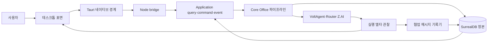

# Phase 30 제품 통합·정합성 설계

> **상태:** 구현 기준 설계
> **작성일:** 2026-07-24
> **정본:** `PRODUCT.md`, `docs/product/constitution.md`, `apps/desktop/DESIGN.md`
> **목표:** 완성본 기준으로 만든 데스크톱 표면을 실제 Application 계약과 Core 실행에 연결하고, 사용자 조작 기반 시나리오로 의도한 AgentOS 동작을 증명합니다.

## 1. 결정

세 가지 접근을 검토했습니다.

1. **전 도메인 일괄 구현:** 계약을 한꺼번에 넓힌 뒤 마지막에 앱을 연결합니다. 병렬화는 쉽지만 실제 사용자 흐름을 늦게 보므로 잘못된 계약을 많이 만들 위험이 큽니다.
2. **화면별 완성:** 홈부터 설정까지 화면 단위로 fixture를 실데이터로 바꿉니다. 진척은 빨라 보이지만 Core Work 완주가 계속 뒤로 밀리고 같은 계약을 여러 화면에서 중복 보정하게 됩니다.
3. **세로 흐름 우선:** 홈·사명 입력의 표면을 먼저 닫은 뒤, Work 하나가 입력→협업→승인→실행→Assurance→Records까지 실제 앱에서 완주하도록 코어를 연결합니다. 이후 조직·개선·확장·설정을 같은 방식으로 붙입니다.

**3번을 채택합니다.** 사용자가 정한 “표면부터 빠르게, 그다음 코어부터 정합성, 문제 사례만 회귀 테스트” 원칙과 제품 헌법의 “Work 하나의 완주가 표면 넓이보다 우선”을 동시에 만족합니다.

## 2. 현재 기준선

| 영역 | 확인된 사실 | 남은 일 |
|---|---|---|
| 데스크톱 표면 | 홈·업무·조직·개선·확장·설정과 전역 수신함이 커밋됨 | 홈과 새 사명 입력을 실 워크스페이스·파일 문맥에 연결 |
| 데스크톱 자동 검사 | 타입 검사 통과, 7개 파일 67개 테스트 통과 | 실제 Tauri 앱 조작 근거 없음 |
| Application | 52개 파일 324개 테스트 통과, 2개 건너뜀 | 여러 등록 조회·명령이 타입 지도에서 빠짐 |
| Server | 40개 파일 237개 테스트 통과, 2개 건너뜀 | 실제 데스크톱에서 Core 완주 재검증 필요 |
| 전체 lint | 현재 dirty worktree의 untracked 캡처 안 제3자 config를 `eslint .`이 읽어 중단; 추적 대상 데스크톱 검사는 실제 오류 78건 보고 | 사용자 산출물은 건드리지 않고 데스크톱 오류를 기계적으로 정리한 뒤 clean clone에서 전체 gate 실행 |
| GLM 개발·개인 BYOK | 개인 소유 Coding Plan `glm-5.2` Core UAT 2건과 키 존재 기록 | 개발·테스트·패치와 개인용 로컬 도그푸딩에 사용하고 키·계정·할당량의 소유자 격리를 확인 |
| 협업 | 방 도메인과 VoltAgent 위임은 존재 | 실제 위임이 방 메시지로 영속되지 않음 |
| 조직 | 구조+지도 UI, 범용 `organization.command` 존재 | 실 계층·scope 투영, 제안/영향/승인, 데스크톱 명령 연결 |
| 개선 | 도메인 평가·채택·효과·되돌리기, `growth.adopt`·`growth.revert` 존재 | 상세 조회, evaluate/reject, 타입 계약, 데스크톱 연결 |
| 확장 | lifecycle·worker·gateway·Registry 설치가 서버에 조립됨 | 설치 manifest Capability 투영과 Agent Runtime 소비 |
| 설정 | 일곱 조회가 실제 등록됨 | 타입 계약과 로컬 운영 상태 조회 |

이 표는 구현 중 매 조각 종료 시 갱신합니다. 테스트 통과와 실제 사용자 인수 검증(UAT)은 같은 상태로 취급하지 않습니다.

## 3. 범위

### 포함

- 홈 대시보드와 새 사명 입력의 최종 UX
- 네이티브 디렉터리 선택, 워크스페이스 등록·신뢰, 워크스페이스 안의 파일 첨부
- Tauri → bridge → daemon → Application → Core Office → Provider 전체 실행
- 실제 에이전트 위임의 협업방 영속 기록
- 조직 계층·임시 범위·조직 변경 제안·영향·승인 연결
- 개선 평가·승인·거절·효과·되돌리기 연결
- 설치된 확장의 Capability·권한 투영과 최소 Tool 사용 흐름
- 설정 조회 타입화와 로컬 daemon·데이터·백업 상태
- 수신함·홈·소유 화면의 동일 상태 투영
- 최소 12개 실제 데스크톱 시나리오와 증거 문서

### 제외

- 제거 예정인 Web·TUI의 신규 기능이나 시각 보정
- 다중 워크스페이스를 한 Work에 바인딩하는 새 도메인
- 워크스페이스 밖 임의 파일을 복사·업로드하는 범용 첨부 저장소
- 실제 실패가 확인되지 않은 성능 최적화와 추상화
- Shared Context Reference·Resource Lease의 생산 연결. 실제 공유 쓰기 충돌 시나리오가 생길 때 별도 설계합니다.
- 복수 Provider 계정 순환 실증. 계정 하나만 제공된 현재 환경에서는 구조 테스트만 유지합니다.

## 4. 구현 순서

### 단계 0 — 기준선과 문서 정합성

1. 데스크톱 추적 소스의 현재 strict lint 오류를 기능 변경과 분리해 정리합니다.
2. 기존 핸드오프 주장과 실제 코드의 operation·필드·서버 조립을 대조합니다.
3. 각 실패를 `기존 실패`, `이번 변경 회귀`, `외부 환경 실패`로 분류할 증거 템플릿을 만듭니다.

종료 조건: 데스크톱·Application·Server 표적 테스트가 통과하고 데스크톱 추적 소스 lint가 0입니다. 전체 lint는 사용자 untracked 산출물이 없는 clean clone 최종 게이트에서 판정합니다.

### 단계 1 — 홈과 사명 입력

1. 홈은 새 사명, 나를 기다리는 것, 지금 도는 것만 유지합니다.
2. 내부 워크스페이스 ID 입력을 제거하고 저장된 워크스페이스 선택과 네이티브 폴더 추가로 바꿉니다.
3. 선택된 워크스페이스 안의 파일만 참조 파일로 추가합니다.
4. 등록된 폴더가 `pending`이면 경로와 권한 영향을 보여준 뒤 신뢰 결정을 받습니다.

종료 조건: 사용자가 식별자를 입력하지 않고 빈 상태에서 폴더·파일 문맥이 있는 Work를 시작하고 자동으로 업무 상세로 이동합니다.

### 단계 2 — Core Work 실제 완주

1. 구현·테스트 작성·실패 분석은 Z.AI Coding Plan `glm-5.2`로 수행합니다. 실제 Massion 실행도 개인 소유 키를 로컬 BYOK로 등록하되 키·계정·할당량을 소유자 밖으로 전달하지 않습니다.
2. Representative→Context & Strategy→Evidence→Delivery→Assurance→Records의 실제 상태를 데스크톱이 사건 스트림으로 따라갑니다.
3. 승인, 차단, 추가 지시, 취소, 재개가 소유 화면과 수신함에서 같은 상태를 봅니다.
4. 결과 산출물과 독립 검증이 없으면 완료로 표시하지 않습니다.

종료 조건: 실제 Provider Work 하나가 데스크톱에서 `completed`까지 가며 산출물·검증·기록을 모두 열 수 있습니다.

### 단계 3 — 협업과 조직

1. `delegate_task` 호출에 필요한 안전한 위임 메타데이터를 실행 델타에 보존합니다.
2. 위임과 응답을 기존 Core Office 방에 `handoff`·`answer`로 영속합니다.
3. 조직 snapshot에 `parent_handle`·`scope`·`work_id`를 연결합니다.
4. 조직 변경은 지도 드래그 즉시 적용이 아니라 영향·승인·개정 충돌을 가진 제안으로 만듭니다.

종료 조건: 재시작 뒤에도 실제 에이전트 협업이 방에 남고, 조직 구조와 지도 선택이 같은 실데이터를 가리킵니다.

### 단계 4 — 개선

상세 근거 조회와 타입 계약을 먼저 연결하고, 평가→승인 또는 거절→효과 관측→되돌리기 순서로 명령을 엽니다. UI는 이미 만든 완성본 레이아웃을 유지하고 fixture만 제거합니다.

종료 조건: 실제 Work에서 나온 제안을 사용자가 근거·반대 신호·diff와 함께 판단하고 후속 효과 또는 되돌리기까지 추적합니다.

### 단계 5 — 확장과 설정

1. 설치된 확장 manifest의 contributions·permissions를 `extension.list`에 싣습니다.
2. 공식 최소 확장 하나의 Tool을 Agent Runtime이 실제 Work에서 사용하게 연결합니다.
3. Registry와 설정 조회를 타입화하고 데스크톱 런타임 파서를 삭제합니다.
4. daemon 버전·상태, 데이터 위치, 마지막 백업을 읽기 전용으로 표시합니다.

종료 조건: 설치→승인→활성화→Capability 표시→Work 사용과 Provider·로컬 운영 상태 확인이 실제 앱에서 이어집니다.

### 단계 6 — 실제 사용자 인수 검증

`2026-07-24-desktop-live-uat-design.md`의 시나리오를 순서대로 실행합니다. 각 시나리오는 Computer Use 접근성 트리, 스크린샷, daemon 로그, 데이터 조회 중 필요한 최소 증거를 남깁니다.

## 5. 데이터 흐름

렌더러는 파일시스템을 직접 읽지 않습니다. 네이티브 선택기가 사용자가 고른 경로만 돌려주고, daemon이 워크스페이스 경계와 신뢰를 다시 검증합니다. 모델 출력과 휘발성 델타는 완료나 조직 상태의 정본이 아니며, 확정된 도메인 사건만 SurrealDB에 남습니다.

## 6. 테스트 원칙

### 미리 작성하는 최소 사양 테스트

다음은 실패 후에야 발견하기에는 비용이 큰 신뢰 경계이므로 한 개의 집중 테스트를 먼저 둡니다.

- 워크스페이스 경로·symlink·신뢰 경계
- command revision과 승인·채택의 비교 후 교환(CAS)
- 비밀값이 조회·오류·스크린샷에 나오지 않는 경계
- 협업 메시지 멱등성과 실행을 죽이지 않는 기록 실패
- 완료가 Assurance를 우회하지 않는 상태 전이

### 나머지 테스트

1. 실제 시나리오를 먼저 실행합니다.
2. 실패하면 가장 낮은 공통 원인 계층에서 재현하는 테스트 **하나**를 만듭니다.
3. 공통 경로를 최소 수정합니다.
4. 새 회귀 테스트, 실패한 실제 시나리오, 인접 표적 테스트만 다시 실행합니다.
5. 조각 종료 시에만 넓은 게이트를 실행합니다.

컴포넌트 문구·스타일 변형마다 유닛 테스트를 만들지 않습니다. 시각 문제는 실제 화면과 스크린샷으로 확인하고, 재발 가능성이 있는 구조적 문제만 기존 `app.integration.test.tsx` 또는 `styles.test.ts`에 한 건 추가합니다.

## 7. 오류 처리

- 외부 Provider 실패는 `blocked`로 보존하고 재개 행동을 제공합니다.
- 승인·조직·개선 revision 충돌은 덮어쓰지 않고 다시 읽은 뒤 사용자가 재검토합니다.
- 협업 기록 실패는 실행을 중단하지 않지만 운영 로그와 영속 진단 사건에 남깁니다.
- 네이티브 파일 선택 취소는 오류가 아닙니다.
- 워크스페이스 밖 파일, 외부로 빠지는 symlink, 존재하지 않는 경로는 Work 생성 전에 거부합니다.
- 승인된 Provider·모델 사전 확인이 실패하면 다른 모델로 조용히 대체하지 않습니다.

## 8. 커밋과 증거

각 단계는 다음 순서를 지킵니다.

1. 문서·계약 정정
2. 최소 실행 가능한 코드 조각
3. 그 조각의 표적 검증
4. 코드 커밋
5. 실제 앱 시나리오 증거와 문서 커밋

공용 파일(`packages/application/src/contracts.ts`, `query-registry.ts`, `adapters/domain.ts`, `apps/server/src/product.ts`, `apps/desktop/src/app.tsx`)은 기능 조각별 변경만 스테이징합니다. 관련 없는 기존 untracked 파일은 건드리지 않습니다.

## 9. 전체 완료 판정

- [ ] 홈에서 식별자 입력 없이 무워크스페이스 Work와 워크스페이스 Work를 모두 시작할 수 있다
- [ ] 워크스페이스 안 파일 첨부가 실제 Context & Strategy 입력에 남는다
- [ ] 실제 GLM Work가 Core 6단계와 독립 Assurance·Records를 거쳐 완료된다
- [ ] 실제 위임이 재시작 뒤에도 협업방에서 읽힌다
- [ ] 수신함·홈·업무의 승인·차단 수가 동일하다
- [ ] 조직 구조·지도·제안·승인이 같은 실데이터를 가리킨다
- [ ] 개선 평가·승인/거절·효과·되돌리기가 한 계보로 보인다
- [ ] 확장 Capability가 설치 뒤 표시되고 Work에서 실제 사용된다
- [ ] 설정이 Provider와 로컬 daemon 상태를 타입 안전하게 보여준다
- [ ] 실제 데스크톱 시나리오 12개 이상이 오류 없이 통과한다
- [ ] `pnpm verify`, 데스크톱 릴리스 빌드, 재시작 지속성 검증이 같은 후보 커밋에서 통과한다
- [ ] 같은 후보 SHA의 macOS arm64 앱이 Developer ID로 서명·공증·스테이플되고 `codesign`, Gatekeeper, `stapler` 검사를 통과한다
- [ ] 깨끗한 macOS 사용자 환경에서 설치, 이전 후보 교체 업데이트, 앱 제거, 재설치를 수행해 앱 데이터 보존 정책과 실행 가능성을 확인한다
- [ ] 개인 데이터의 실제 백업→빈 데이터 복구→핵심 Work·조직·기록 대조를 완료한다
- [ ] daemon·SurrealDB sidecar 강제 종료와 앱 재실행 뒤 중복 실행·사건 유실·데이터 손상이 없음을 확인한다
- [ ] 키보드만으로 핵심 12개 흐름을 수행하고 VoiceOver·Accessibility Inspector에서 치명적 접근성 오류가 없음을 확인한다
- [ ] 개발·테스트·실패 패치와 개인용 GLM-5.2 BYOK UAT 범위를 기록하고 키·계정·할당량이 소유자 경계 밖으로 노출되지 않았음을 확인한다
