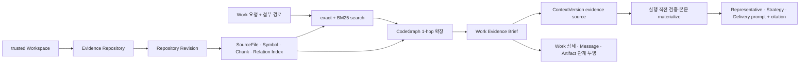

# 개인용 v1 지식·기억 계층 통합 설계

> **상태:** 구현 기준 설계
>
> **작성일:** 2026-07-25
>
> **상위 설계:** `2026-07-24-phase-30-product-integration-design.md`
>
> **목표:** 이미 구현된 코드 인덱스·Evidence·Growth Memory를 실제 Work 실행과 데스크톱에 연결해, 개인용 AgentOS가 근거와 기억을 다음 실행에서 재사용하도록 합니다.

## 1. 문제와 결정

현재 저장소에는 다음 기반이 남아 있습니다.

| 축 | 남아 있는 기반 | 생산 경로의 단절 |
|---|---|---|
| 코드 지식 | `source_file`, `evidence_symbol`, `evidence_chunk`, `evidence_relation`, Tree-sitter 파서 | Scanner·Indexer·Search가 서버에 조립되지 않음 |
| RAG | exact·BM25 검색과 선택적 `EmbeddingSearchPort`, `EvidenceBrief` | Work가 검색하지 않고 Brief ID만 검증함 |
| 대화 기억 | Work·Room·Message·ContextVersion·Records | 다음 Work에서 검색·재사용하지 않음 |
| 장기 기억 | versioned `memory_version`, PromptVersion 합성, runtime lineage 계약 | `WorkService`, `RuntimeExecutionStore`, Agent instruction에 생산 주입되지 않음 |
| LSP | 없음 | 구현·의존성·계획이 없음 |
| SurrealDB 그래프 | 일반 `evidence_relation` 행과 문자열 key | `TYPE RELATION`·`RELATE`·DB traversal을 사용하지 않음 |

세 가지 복구 방식을 검토했습니다.

1. **전체 지식 플랫폼 동시 구현:** LSP, embedding, SurrealDB native relation, 전역 지식 그래프를 한 번에 추가합니다. 기존 단절보다 새 저장 계층을 먼저 늘리므로 v1 범위로는 큽니다.
2. **화면만 복원:** 저장된 기억과 인덱스 상태를 읽기 전용으로 보여줍니다. Agent가 실제로 사용하지 않으므로 제품 약속을 충족하지 않습니다.
3. **기존 기반의 세로 흐름 복원:** Work를 중심으로 기존 Evidence 인덱스와 Growth Memory를 생산 조립하고, 검색 결과·사용 기억·출처를 실행 계보와 화면에 연결합니다.

**3번을 채택합니다.** v1의 핵심 결함은 SurrealDB graph 문법이나 vector database가 없는 것이 아니라, 이미 저장된 지식과 기억이 Agent 입력으로 흐르지 않는 것입니다.

## 2. 요구사항

- **REQ-KNOWLEDGE-001:** 신뢰된 로컬 Workspace는 한 Evidence Repository와 안정적으로 결속되고, 현재 파일 snapshot이 versioned SourceFile·Symbol·Chunk·Relation 인덱스로 만들어집니다.
- **REQ-KNOWLEDGE-002:** Workspace Work는 사용자 요청과 명시적 첨부 경로를 기준으로 현재 인덱스를 검색하고, 결과를 Work 소유 Evidence Brief와 Context source로 고정한 뒤 실제 Agent 입력에 내용과 출처를 함께 전달합니다.
- **REQ-MEMORY-001:** 사용자가 직접 저장한 개인 명시적 기억은 versioned Memory와 PromptVersion에 고정되고 새 Work부터 실제 Agent instruction에 적용됩니다. 사용 중지 뒤에는 이후 Work에서 제외되며 과거 계보는 변경되지 않습니다.
- **REQ-KNOWLEDGE-UAT-001:** 실제 Tauri 앱에서 색인·검색·출처·재시작·stale 처리와 기억 저장·적용·사용 중지를 검증하고, tenant·Workspace·비밀 경계를 침범하지 않습니다.

## 3. 정본과 권위

지식 종류마다 정본과 권위가 다릅니다. 하나의 범용 vector memory로 합치지 않습니다.

| 종류 | 정본 | 권위·수명 |
|---|---|---|
| 현재 대화 | Work·협업방 Message | Work에 귀속된 사건 기록. Runtime transcript가 대체하지 않음 |
| 요청별 판단 문맥 | ContextVersion·StrategyGeneration | Work 생성 이후 immutable snapshot |
| 코드 근거 | RepositoryRevision·IndexVersion·EvidenceBrief | 실제 파일 snapshot과 checksum에 결속 |
| 개인 명시적 기억 | Growth `memory_version` | 사용자 직접 입력이 최우선. Work 생성 시 PromptVersion에 고정 |
| 학습 기억 후보 | Growth Suggestion·source reference | 사람이 승인하기 전 Agent prompt에 미적용 |
| 실행 계보 | RuntimeExecution·Records | 사용한 PromptVersion·MemoryVersion·EvidenceBrief ID를 보존 |

VoltAgent `SurrealMemoryAdapter`는 제품 장기 기억 정본으로 활성화하지 않습니다. 실제 대화는 이미 Work·Room·Message가 소유하며, 두 번째 conversation 저장소를 켜면 삭제·권위·재생 규칙이 갈립니다. `memory: false`는 유지하고 Growth Memory를 versioned Agent instruction으로 주입합니다.

## 4. 데이터 경계

### 4.1 Workspace와 Repository 결속

`evidence_repository`에 선택적 `workspace_id`와 Workspace 결속용 guard key를 추가합니다.

```ts
export interface EvidenceRepository {
  readonly repositoryId: string;
  readonly organizationId: string;
  readonly workspaceId?: string;
  // 기존 필드 유지
}
```

규칙:

- 동일 조직의 Workspace 하나는 수명 동안 하나의 Evidence Repository에 안정적으로 결속되고, 변경은 새 Repository가 아니라 새 Revision·IndexVersion으로 남습니다.
- `workspace_guard_key`는 결속된 Repository에만 `${organizationId}:${workspaceId}`로 저장하고 unique index를 겁니다. Workspace와 무관한 기존 Repository에는 필드를 저장하지 않습니다.
- Repository의 `rootRef`와 `rootRealPathHash`는 Workspace의 canonical path와 다시 검증합니다.
- Workspace가 archived 또는 blocked면 새 색인과 검색을 거부합니다.
- Repository를 제거하지 않고 새 Revision·IndexVersion을 추가합니다.
- 독립 Project 엔터티가 없으므로 `project_id`를 Workspace 식별자로 재사용하지 않습니다.

### 4.2 인덱스 범위

기존 `RepositoryScanner`, `RepositoryRevisionCollector`, `EvidenceParser`, `EvidenceIndexer`, `CodeSearchService`, `CodeGraphService`를 그대로 조립합니다. 현재 parser의 relation resolve는 파일 안에서만 동작하므로, 모든 파일을 stage한 뒤 같은 building IndexVersion의 전체 symbol을 대상으로 `imports`·`calls`·`implements` 관계를 다시 평가합니다. target 이름이 유일하게 하나일 때만 `targetSymbolKey`를 채우고, 모호하거나 찾지 못한 관계는 기존 값도 지우고 unresolved로 유지합니다. 이렇게 해야 이전 IndexVersion에서 clone된 relation이 삭제된 target을 계속 가리키지 않습니다.

v1 기본값:

```ts
const PERSONAL_INDEX_OPTIONS = {
  include: ["**/*"],
  exclude: [],
  maxFileBytes: 1_048_576,
} as const;
```

`.gitignore`, `.massionignore`, 기본 제외 디렉터리, symlink·binary·oversized·invalid UTF-8 거부와 secret redaction은 기존 Scanner 규칙을 유지합니다. Renderer는 파일 내용을 읽지 않습니다.

Work에 `workspacePaths`가 있으면 명시적으로 첨부한 파일의 chunk를 우선 근거로 삼고 검색 결과도 해당 상대 경로로 제한합니다. 경로가 없으면 신뢰된 Workspace 전체 current index에서 검색합니다. 검색 API에 선택적 `relativePaths` filter를 추가하며, 결과가 다른 파일로 새지 않도록 DB query와 snapshot exact match 양쪽에 적용합니다.

자동 생성 Brief에는 `workspaceId`, 실제 검색 query, 정렬된 `workspacePaths`의 SHA-256인 `scopeChecksum`을 저장합니다. 기존·수동 Brief와 호환되도록 필드는 optional이지만 Core 자동 경로는 이 값이 있는 Brief만 사용합니다. 같은 Work에서 retry가 들어오면 새 색인 전에 기존 ready/no-match 자동 Brief를 읽어 scope checksum과 자체 checksum을 검증하고 같은 Brief를 반환합니다. 다른 자동 scope의 Brief가 이미 있으면 Work request 불변량 위반으로 차단합니다.

검색 상위 결과가 symbol이거나 symbol-bound chunk이면 해당 `symbolKey`를 root로 기존 `CodeGraphService.neighbors()`의 incoming·outgoing 1-hop을 확장합니다. `imports`·`calls`·`implements` 관계에서 최대 8개 관련 symbol만 후보에 합치고, 같은 IndexVersion 밖으로 나가거나 unresolved인 edge는 Agent 근거로 사용하지 않습니다. 이름이 모호한 cross-file 관계를 추측해 연결하지 않습니다. Brief를 만들기 전 각 symbol을 같은 `symbolKey`의 redacted chunk reference로 정규화해 실제 prompt content와 reference hash가 일치하게 합니다. 이 경계로 기존 관계 그래프를 실제 검색에 쓰되 새 graph schema나 전역 탐색기를 만들지 않습니다.

### 4.3 명시적 기억

기존 `MemoryEntry` 저장 형식과 checksum은 바꾸지 않습니다. v1 공개 쓰기 경로를 `scope: "user"`, `subjectId: context.userId`로만 열고, 이 경로에서 만들어진 entry를 Application view에서 `authority: "explicit"`로 투영합니다. organization·agent 기억과 learned 자동 생성은 기존 도메인 내부 계약만 유지하고 사용자 쓰기 표면에서는 열지 않습니다.

이 방식은 이미 저장된 MemoryVersion checksum을 재작성하지 않으면서 권위를 분리합니다. 향후 learned user memory가 실제 요구될 때 별도 schema version과 승인 흐름을 설계합니다.

제한:

- key 1~120자, value 1~4,000자, active entry 최대 100개
- credential·private key·provider token 패턴은 저장 전에 거부
- learned 경로는 user scope에 쓸 수 없음
- command envelope의 `expectedRevision`으로 stale update 거부
- 최초 user memory는 expected revision 0에서 만들 수 있음

`잊기`는 hard delete가 아닙니다. 새 active MemoryVersion에서 key를 제외하고 이후 새 Work의 PromptVersion에 넣지 않습니다. 과거 Work·PromptVersion·Records·백업의 감사 계보는 유지하므로 UI에는 `삭제`가 아니라 `앞으로 사용하지 않음`으로 표시합니다.

## 5. 실행 흐름

### 5.1 코드 지식 흐름



Core 파이프라인은 다음 순서를 가집니다.

1. Workspace 없는 Work는 기존처럼 코드 지식 없이 진행합니다.
2. Intake는 Work 생성 직후 active trusted Workspace와 결속 Repository를 확인합니다.
3. 현재 manifest가 current IndexVersion과 같으면 재사용하고, 달랐으면 새 Revision과 full 또는 incremental index를 완성합니다.
4. 사용자 요청 앞 2,000자를 결정적인 query로 사용해 최대 12개 결과를 찾고, 첨부 파일과 검색 symbol의 1-hop 관계를 합쳐 Work 소유 Evidence Brief를 만듭니다.
5. ready Brief는 Core Office room에 `sourceKind=evidence-brief`, `sourceId=brief ID`, `versionId=index version`, `checksum=brief checksum`인 기존 SharedContextReference로 한 번만 연결합니다. retry에서는 같은 tuple을 조회해 checksum이 같으면 건너뜁니다.
6. Representative에는 같은 Brief에서 검증한 redacted 본문과 `relativePath:startLine-endLine` citation을 전달합니다.
7. Context & Strategy는 `EvidenceContextBinder`가 만든 metadata-only source를 ContextVersion에 고정합니다. 원문은 ContextVersion JSON에 복제하지 않습니다.
8. Strategy와 Delivery는 실행 직전에 Brief·IndexVersion·content hash를 다시 검증하고 같은 redacted 본문을 materialize해 Agent 입력에 전달합니다.
9. Evidence 단계는 검색을 다시 수행하지 않고 Work 소유권·snapshot 존재·checksum을 검사합니다. current index가 달라진 경우 같은 Work는 계획 당시 immutable snapshot으로 계속 실행하고 `stale_warning`을 표시합니다.

Work·Message·Artifact·코드 근거의 v1 관계는 새 edge table 없이 기존 정본을 따라 투영합니다.

```text
Work ─ ContextVersion ─ EvidenceBrief ─ SourceFile / Symbol / Chunk
  ├─ CollaborationMessage
  └─ ArtifactVersion / RuntimeExecution
```

따라서 Work 상세와 Records는 “이 대화와 실행이 어떤 파일·symbol을 사용했는지”를 재구성할 수 있습니다. 문장 하나마다 자동 edge를 생성하거나 과거 모든 Work를 semantic 검색하는 기능은 v1에 넣지 않습니다.

Workspace Work에서 색인 또는 근거 materialize가 실패하면 빈 evidence로 조용히 진행하지 않습니다. Run을 실패한 같은 단계의 `blocked`로 보존하고 기존 `run.resume`의 blocked retry 행동 또는 Workspace 없이 새 Work 시작 행동을 제공합니다. freshness 차이는 실패가 아닙니다. 이미 계획된 Work는 고정 snapshot을 사용하고, 새 current snapshot이 필요한 사용자는 새 Work를 시작합니다. 검색 결과 0건은 오류가 아니라 명시적 `no-match` 상태이며, 첨부 파일이 지정된 경우 해당 파일의 usable chunk도 찾지 못했을 때만 차단합니다.

### 5.2 기억 흐름


생산 조립은 기존 seam을 사용합니다.

- 로컬 bootstrap이 Prompt definition과 organization memory를 준비하고, user memory는 사용자의 첫 저장 command에서 version 1로 만듭니다.
- `WorkService`에 `GrowthWorkPromptAdapter`를 주입해 Work 생성 transaction 안에서 PromptVersion을 고정합니다.
- `RuntimeExecutionStore`에 `GrowthAgentConfigurationReader`를 주입해 Prompt·Memory checksum을 실행에 저장합니다.
- `OrganizationAgentTopology`에 `AgentInstructionRegistry`를 주입해 실제 Agent instruction을 동적으로 읽습니다.
- 이미 생성된 Work는 기억 변경의 영향을 받지 않습니다.

## 6. Application 계약

다음 typed query·command를 추가합니다.

```ts
export interface KnowledgeReferenceViewV1 {
  readonly referenceId: string;
  readonly kind: "symbol" | "chunk";
  readonly relativePath: string;
  readonly qualifiedName?: string;
  readonly startLine: number;
  readonly endLine: number;
  readonly contentHash: string;
}

export interface WorkKnowledgeViewV1 {
  readonly workId: string;
  readonly status: "not-applicable" | "ready" | "no-match" | "blocked";
  readonly repositoryId?: string;
  readonly repositoryRevisionId?: string;
  readonly indexVersionId?: string;
  readonly evidenceBriefId?: string;
  readonly freshnessStatus?: "fresh" | "stale_warning";
  readonly query?: string;
  readonly references: readonly KnowledgeReferenceViewV1[];
  readonly failureReason?: string;
}

export interface ExplicitMemoryEntryViewV1 {
  readonly key: string;
  readonly kind: "fact" | "preference" | "procedure";
  readonly value: string;
  readonly authority: "explicit";
  readonly sourceReferenceIds: readonly string[];
}
```

Operations:

- `work.knowledge`: `{ workId } -> WorkKnowledgeViewV1`
- 기존 `growth.memories`: active user memory의 entry value·authority·revision을 typed view로 확장
- `growth.memory.put`: `{ key, kind, value }`, envelope `expectedRevision`
- `growth.memory.forget`: `{ key }`, envelope `expectedRevision`
- 색인·freshness 차단 재시도는 기존 `run.resume`의 `retryBlocked` 경로를 사용하며 지식 전용 command를 추가하지 않음

내부 Repository·Index ID는 감사/툴팁에만 쓰고 기본 UI label로 노출하지 않습니다.

## 7. 데스크톱 표면

### 업무

Work 상세의 기존 활동 흐름에 `사용한 지식` 블록을 추가합니다.

- ready: 실제 사용한 파일 경로, symbol 이름, line range와 fresh/stale snapshot 구분
- no-match: 검색했지만 관련 근거가 없다는 사실
- blocked: 실패 이유와 `색인 다시 시도`
- citation 선택: 해당 Work의 Evidence 상세와 같은 reference로 이동

그래프 탐색기나 전체 Repository 브라우저는 만들지 않습니다.

### 개선

현재 `조직이 배운 것` 읽기 블록과 구분해 `내 기억`을 둡니다.

- key·kind·value 입력
- `다음 새 업무부터 적용` 안내
- stale revision 시 목록 재조회와 사용자 재검토
- `앞으로 사용하지 않음` 행동
- explicit/learned 권위와 출처 표시

수신함에는 기억 CRUD를 넣지 않습니다. 기억은 멈춘 실행의 승인 항목이 아니라 개선 표면이 소유하는 설정입니다.

## 8. 보안·개인정보·오류

- Workspace trust와 canonical path 검증은 색인 전에 daemon에서 다시 수행합니다.
- symlink는 Scanner 기존 규칙대로 색인하지 않습니다.
- secret redaction 이후 content만 chunk·search·EvidenceBrief 합성에 사용합니다.
- 검색 query·snippet·기억 value는 외부 Massion 서비스로 전송하지 않습니다.
- RuntimeExecution은 기존 계약대로 실제 Agent input을 `input_json`에 감사 기록하므로 bounded redacted snippet과 citation은 로컬 SurrealDB에 남습니다. raw secret과 redaction 전 원문은 남기지 않습니다.
- 다른 tenant·user의 Memory, Repository, Index, Brief를 ID 추측으로 읽지 못해야 합니다.
- index partial/failed snapshot은 current 검색에 사용하지 않습니다.
- PromptVersion·MemoryVersion·EvidenceBrief checksum 불일치는 fail closed입니다.
- hard erasure는 v1에서 제공하지 않으며 제품 문구와 로컬 데이터 정책에 이 사실을 표시합니다.

## 9. 최소 자동 검사와 UAT

미리 작성할 사양 테스트는 다음 네 경계로 제한합니다.

1. Workspace 하나가 Repository 하나에 결속되고 다른 tenant·경로를 거부합니다.
2. current index 재사용·manifest 변경·attached path filter·유일한 cross-file 1-hop 관계가 한 통합 테스트로 동작합니다.
3. Evidence Brief·metadata-only Context source·실행 직전 materialized Agent 입력이 동일 checksum/lineage를 사용합니다.
4. 최초 explicit user memory 생성·stale revision·사용 중지·새 Work RuntimeExecution lineage가 한 표 테스트로 동작합니다.

실제 앱 시나리오는 `2026-07-24-desktop-live-uat-design.md`의 UAT-K01~K04가 소유합니다.

## 10. v1 제외와 확장 게이트

다음은 v1 구현에 넣지 않습니다.

- SurrealDB `TYPE RELATION`·`RELATE`로의 schema 전환
- LSP client/server와 language별 daemon 관리
- embedding 생성기·vector index·HNSW/DISKANN
- 모든 대화 문장을 자동 edge로 만드는 전역 지식 그래프
- 조직·agent·project scope 명시적 memory 편집
- 자동 학습 기억 채택
- 과거 모든 Work·Message의 semantic 검색과 문장 단위 relation 자동 생성
- hard erasure와 과거 Records 재작성

Tree-sitter+BM25 UAT에서 다음 실패가 재현될 때만 별도 설계를 엽니다.

- cross-file definition/reference 정확도가 핵심 UAT를 막음 → LSP track
- lexical 검색이 동의어·개념 검색에서 반복 실패 → embedding track
- TypeScript 순회가 실제 성능 병목으로 측정됨 → SurrealDB native relation track

## 11. 완료 판정

- [ ] 신뢰된 Workspace의 실제 파일이 versioned index에 들어가고 재시작 뒤 재사용됩니다.
- [ ] Workspace Work가 관련 file·symbol·chunk를 검색해 실제 Agent prompt에 내용과 citation을 전달합니다.
- [ ] Work 상세에서 사용한 근거와 index freshness를 확인할 수 있습니다.
- [ ] 사용자가 저장한 explicit memory가 다음 새 Work의 PromptVersion과 실제 응답에 적용됩니다.
- [ ] 기억 사용 중지 뒤 새 Work의 instruction·memory lineage에서 이전 값이 빠집니다.
- [ ] 과거 Work는 당시 PromptVersion·MemoryVersion·EvidenceBrief를 그대로 가리킵니다.
- [ ] tenant·Workspace·secret·checksum 경계 테스트와 UAT-K01~K04가 통과합니다.
- [ ] LSP·embedding·native relation이 미구현임을 UI와 문서가 구현 완료로 주장하지 않습니다.
